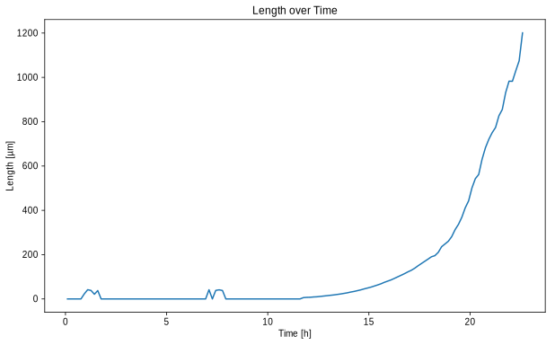
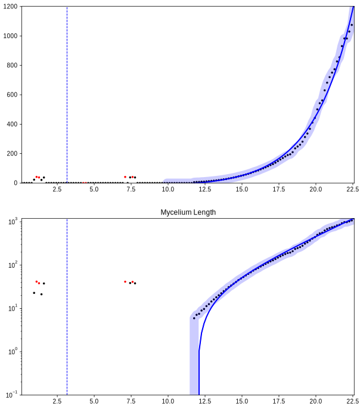

Example Alternative Growth Fit
==============================

Please first see the other Jupyter Notebook, explaining the basics of
accessing mycelyso’s HDF5 files. Furthermore, this file assumes the
``output.h5`` described in the other notebook to be present in the
current directory.

Within this notebook, we will fit the mycelium length data using a
third-party library,
`croissance <https://github.com/biosustain/croissance>`__ (DOI:
`10.5281/zenodo.229905 <https://dx.doi.org/10.5281/zenodo.229905>`__ by
Lars Schöning (2017)). Please install the current version off github
first:

::

   pip install https://github.com/biosustain/croissance/archive/master.zip

First, some general setup …

.. code:: python

    %matplotlib inline
    %config InlineBackend.figure_formats=['svg']
    import pandas
    pandas.options.display.max_columns = None
    import numpy as np
    import warnings
    import croissance
    from croissance.figures import PDFWriter as CroissancePDFWriter
    from matplotlib import pyplot
    
    class OutputInstead:
        @classmethod
        def savefig(cls, fig):
            pyplot.gcf().set_size_inches(10, 12)
            pyplot.show()
            
    # croissance's PDFWriter is supposed to write to a PDF
    # but we want an inline figure, so we mock some bits
    CroissancePDFWriter.doc = OutputInstead
    CroissancePDFWriter._include_shifted_exponentials = False
    def display_result(result, name="Mycelium Length"):
        return CroissancePDFWriter.write(CroissancePDFWriter, name, result)
    
    warnings.simplefilter(action='ignore', category=FutureWarning)
    
    pyplot.rcParams.update({
        'figure.figsize': (10, 6), 'svg.fonttype': 'none',
        'font.sans-serif': 'Arial', 'font.family': 'sans-serif',
        'image.cmap': 'gray_r', 'image.interpolation': 'none'
    })

Opening the HDF5 file
---------------------

We will load the ``output.h5`` using ``pandas.HDFStore`` …

.. code:: python

    store = pandas.HDFStore('output.h5', 'r')
    root = store.get_node('/')
    for image_file in root.results:
        print(image_file)
        for position in image_file:
            print(position)
            break

.. parsed-literal::

    /results/mycelyso_S_lividans_TK24_Complex_Medium_nd046_138_ome_tiff (Group) ''
    /results/mycelyso_S_lividans_TK24_Complex_Medium_nd046_138_ome_tiff/pos_000000000_t_Collected (Group) ''

and load the first growth curve

.. code:: python

    result_table_collected = store[position.result_table_collected._v_pathname]
    timepoint = result_table_collected.timepoint / (60*60)
    length = result_table_collected.graph_edge_length
    
    pyplot.title('Length over Time')
    
    pyplot.xlabel('Time [h]')
    pyplot.ylabel('Length [µm]')
    
    pyplot.plot(timepoint, length)

.. parsed-literal::

    [<matplotlib.lines.Line2D at 0x7fb7dd6e5160>]

Here, we will use the third party tool ``croissance`` to fit the data to
an exponential growth model:

.. code:: python

    curve = pandas.Series(data=np.array(length), index=np.array(timepoint))
    
    estimator = croissance.Estimator()
    result = estimator.growth(curve)
    # print(result)
    print(result.growth_phases)

.. parsed-literal::

    [GrowthPhase(start=9.928127173487246, end=22.594538504723342, slope=0.36693539043981077, intercept=3.1588539520729086, n0=-25.525547240977755, attributes={'SNR': 172.5009988033075, 'rank': 100.0})]

And furthermore use its plotting functionality to show the results:

.. code:: python

    print("Growth rate as determined by croissance µ=%.2f" % (result.growth_phases[0].slope,))
    display_result(result)

.. parsed-literal::

    Growth rate as determined by croissance µ=0.37

