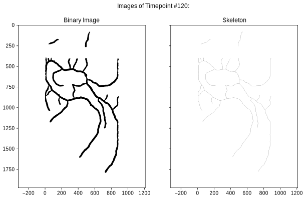
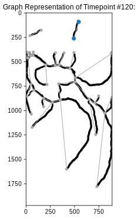
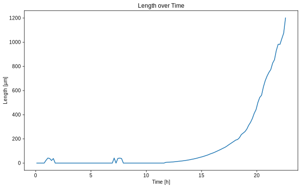
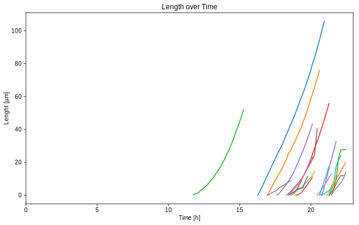

Example HDF5 Insights
=====================

This Jupyter Notebook should give a brief overview how to
programmatically analyze the HDF5 files produced by *mycelyso*. Please
note that you can always inspect these files with *mycelyso Inspector*
as well, this tutorial should just give you a hint how to open these
files if you might want to write your own analyses.

First, it is assumed that an ``output.h5`` is present in the current
directory, with an analysis of the *example dataset* contained.

You can fetch the *example dataset* by running ``get-dataseth.sh`` or
download it manually at https://zenodo.org/record/376281.

Afterwards, analyze it with:

::

    > python -m mycelyso S_lividans_TK24_Complex_Medium_nd046_138.ome.tiff -t BoxDetection=1

Afterwards, you will have an ``output.h5`` in the residing in the
directory.

We will be using `Pandas <https://pandas.pydata.org>`__ to read our
data, while the non-tabular data could easily be read with any other
HDF5 compatible tool, the tabular data is layed out in a chunked format
particular to Pandas, and as such it is easiest to open it with Pandas.

First, some general setup …

.. code:: python

    %matplotlib inline
    %config InlineBackend.figure_formats=['svg']
    import pandas
    pandas.options.display.max_columns = None
    import numpy as np
    import networkx as nx
    from networkx.readwrite import GraphMLReader
    
    from matplotlib import pyplot, ticker
    pyplot.rcParams.update({
        'figure.figsize': (10, 6), 'svg.fonttype': 'none',
        'font.sans-serif': 'Arial', 'font.family': 'sans-serif',
        'image.cmap': 'gray_r', 'image.interpolation': 'none'
    })

Opening the HDF5 file
---------------------

We will load the ``output.h5`` using ``pandas.HDFStore`` …

.. code:: python

    store = pandas.HDFStore('output.h5', 'r')
    store

.. parsed-literal::

    <class 'pandas.io.pytables.HDFStore'>
    File path: output.h5
    /results/mycelyso_S_lividans_TK24_Complex_Medium_nd046_138_ome_tiff/pos_000000000_t_Collected/result_table                                                                          frame        (shape->[1,208]) 
    /results/mycelyso_S_lividans_TK24_Complex_Medium_nd046_138_ome_tiff/pos_000000000_t_Collected/result_table_collected                                                                frame        (shape->[136,27])
    /results/mycelyso_S_lividans_TK24_Complex_Medium_nd046_138_ome_tiff/pos_000000000_t_Collected/tables/_individual_track_table_aux_tables/track_table_aux_tables_000000001            frame        (shape->[22,8])  
    /results/mycelyso_S_lividans_TK24_Complex_Medium_nd046_138_ome_tiff/pos_000000000_t_Collected/tables/_individual_track_table_aux_tables/track_table_aux_tables_000000002            frame        (shape->[29,8])  
    /results/mycelyso_S_lividans_TK24_Complex_Medium_nd046_138_ome_tiff/pos_000000000_t_Collected/tables/_individual_track_table_aux_tables/track_table_aux_tables_000000003            frame        (shape->[11,8])  
    /results/mycelyso_S_lividans_TK24_Complex_Medium_nd046_138_ome_tiff/pos_000000000_t_Collected/tables/_individual_track_table_aux_tables/track_table_aux_tables_000000004            frame        (shape->[23,8])  
    /results/mycelyso_S_lividans_TK24_Complex_Medium_nd046_138_ome_tiff/pos_000000000_t_Collected/tables/_individual_track_table_aux_tables/track_table_aux_tables_000000005            frame        (shape->[16,8])  
    /results/mycelyso_S_lividans_TK24_Complex_Medium_nd046_138_ome_tiff/pos_000000000_t_Collected/tables/_individual_track_table_aux_tables/track_table_aux_tables_000000006            frame        (shape->[14,8])  
    /results/mycelyso_S_lividans_TK24_Complex_Medium_nd046_138_ome_tiff/pos_000000000_t_Collected/tables/_individual_track_table_aux_tables/track_table_aux_tables_000000007            frame        (shape->[12,8])  
    /results/mycelyso_S_lividans_TK24_Complex_Medium_nd046_138_ome_tiff/pos_000000000_t_Collected/tables/_individual_track_table_aux_tables/track_table_aux_tables_000000008            frame        (shape->[9,8])   
    /results/mycelyso_S_lividans_TK24_Complex_Medium_nd046_138_ome_tiff/pos_000000000_t_Collected/tables/_individual_track_table_aux_tables/track_table_aux_tables_000000009            frame        (shape->[17,8])  
    /results/mycelyso_S_lividans_TK24_Complex_Medium_nd046_138_ome_tiff/pos_000000000_t_Collected/tables/_individual_track_table_aux_tables/track_table_aux_tables_000000010            frame        (shape->[11,8])  
    /results/mycelyso_S_lividans_TK24_Complex_Medium_nd046_138_ome_tiff/pos_000000000_t_Collected/tables/_individual_track_table_aux_tables/track_table_aux_tables_000000011            frame        (shape->[8,8])   
    /results/mycelyso_S_lividans_TK24_Complex_Medium_nd046_138_ome_tiff/pos_000000000_t_Collected/tables/_individual_track_table_aux_tables/track_table_aux_tables_000000012            frame        (shape->[7,8])   
    /results/mycelyso_S_lividans_TK24_Complex_Medium_nd046_138_ome_tiff/pos_000000000_t_Collected/tables/_individual_track_table_aux_tables/track_table_aux_tables_000000013            frame        (shape->[10,8])  
    /results/mycelyso_S_lividans_TK24_Complex_Medium_nd046_138_ome_tiff/pos_000000000_t_Collected/tables/_individual_track_table_aux_tables/track_table_aux_tables_000000014            frame        (shape->[5,8])   
    /results/mycelyso_S_lividans_TK24_Complex_Medium_nd046_138_ome_tiff/pos_000000000_t_Collected/tables/_individual_track_table_aux_tables/track_table_aux_tables_000000015            frame        (shape->[7,8])   
    /results/mycelyso_S_lividans_TK24_Complex_Medium_nd046_138_ome_tiff/pos_000000000_t_Collected/tables/_individual_track_table_aux_tables/track_table_aux_tables_000000016            frame        (shape->[5,8])   
    /results/mycelyso_S_lividans_TK24_Complex_Medium_nd046_138_ome_tiff/pos_000000000_t_Collected/tables/_individual_track_table_aux_tables/track_table_aux_tables_000000017            frame        (shape->[7,8])   
    /results/mycelyso_S_lividans_TK24_Complex_Medium_nd046_138_ome_tiff/pos_000000000_t_Collected/tables/_individual_track_table_aux_tables/track_table_aux_tables_000000018            frame        (shape->[8,8])   
    /results/mycelyso_S_lividans_TK24_Complex_Medium_nd046_138_ome_tiff/pos_000000000_t_Collected/tables/_individual_track_table_aux_tables/track_table_aux_tables_000000019            frame        (shape->[8,8])   
    /results/mycelyso_S_lividans_TK24_Complex_Medium_nd046_138_ome_tiff/pos_000000000_t_Collected/tables/_individual_track_table_aux_tables/track_table_aux_tables_000000020            frame        (shape->[7,8])   
    /results/mycelyso_S_lividans_TK24_Complex_Medium_nd046_138_ome_tiff/pos_000000000_t_Collected/tables/_mapping_track_table_aux_tables/track_table_aux_tables_000000000               frame        (shape->[20,2])  
    /results/mycelyso_S_lividans_TK24_Complex_Medium_nd046_138_ome_tiff/pos_000000000_t_Collected/tables/track_table/track_table_000000000                                              frame        (shape->[20,66]) 

Now let's dive a bit into the HDF5 file.

Remember that HDF5 stands for *Hierarchical* Data Format 5 …

.. code:: python

    root = store.get_node('/')
    
    print("Root:")
    print(repr(root))
    print()
    print("/results:")
    print(repr(root.results))

.. parsed-literal::

    Root:
    / (RootGroup) ''
      children := ['results' (Group)]
    
    /results:
    /results (Group) ''
      children := ['mycelyso_S_lividans_TK24_Complex_Medium_nd046_138_ome_tiff' (Group)]

The key names are dependent on the on-disk path of the analyzed file.
Assuming there is only one file analyzed with one position in the file,
we pick the first …

.. code:: python

    for image_file in root.results:
        print(image_file)
        for position in image_file:
            print(position)
            break

.. parsed-literal::

    /results/mycelyso_S_lividans_TK24_Complex_Medium_nd046_138_ome_tiff (Group) ''
    /results/mycelyso_S_lividans_TK24_Complex_Medium_nd046_138_ome_tiff/pos_000000000_t_Collected (Group) ''

We can now investigate what data is available for that particular
position

There is e.g., (binary) data, there are images, and there are various
tabular datasets

.. code:: python

    print("data")
    print(position.data)
    for node in position.data:
        print(node)
        
    print()
        
    print("nodes")
    print(position.images)
    for node in position.images:
        print(node)
        
    print()    

.. parsed-literal::

    data
    /results/mycelyso_S_lividans_TK24_Complex_Medium_nd046_138_ome_tiff/pos_000000000_t_Collected/data (Group) ''
    /results/mycelyso_S_lividans_TK24_Complex_Medium_nd046_138_ome_tiff/pos_000000000_t_Collected/data/banner (Group) ''
    /results/mycelyso_S_lividans_TK24_Complex_Medium_nd046_138_ome_tiff/pos_000000000_t_Collected/data/graphml (Group) ''
    /results/mycelyso_S_lividans_TK24_Complex_Medium_nd046_138_ome_tiff/pos_000000000_t_Collected/data/overall_graphml (Group) ''
    /results/mycelyso_S_lividans_TK24_Complex_Medium_nd046_138_ome_tiff/pos_000000000_t_Collected/data/tunables (Group) ''
    /results/mycelyso_S_lividans_TK24_Complex_Medium_nd046_138_ome_tiff/pos_000000000_t_Collected/data/version (Group) ''
    
    nodes
    /results/mycelyso_S_lividans_TK24_Complex_Medium_nd046_138_ome_tiff/pos_000000000_t_Collected/images (Group) ''
    /results/mycelyso_S_lividans_TK24_Complex_Medium_nd046_138_ome_tiff/pos_000000000_t_Collected/images/binary (Group) ''
    /results/mycelyso_S_lividans_TK24_Complex_Medium_nd046_138_ome_tiff/pos_000000000_t_Collected/images/skeleton (Group) ''
    

Accessing Graph and Image Data
------------------------------

Let's for example start with pulling out an image from the file, and
displaying it …

.. code:: python

    binary_images = list(position.images.binary)
    skeleton_images = list(position.images.skeleton)
    
    n = 120
    
    total = len(binary_images)
    assert 0 <= n < total
    
    print("Total count of images: %d" % (total,))
    
    fig, (ax_l, ax_r) = pyplot.subplots(1, 2, sharey=True)
    
    fig.suptitle('Images of Timepoint #%d:' % (n,))
    
    ax_l.imshow(binary_images[n])
    ax_l.set_title('Binary Image')
    
    ax_r.imshow(skeleton_images[n])
    ax_r.set_title('Skeleton')

.. parsed-literal::

    Total count of images: 136

.. parsed-literal::

    Text(0.5,1,'Skeleton')

Let's now take a look at the graph data present for the position,
display it and overlay it onto the image data …

.. code:: python

    # The graph structure is saved in GraphML
    draw_parameters = dict(node_size=25, node_color='darkgray', linewidths=0, edge_color='darkgray', with_labels=False)
    
    #graphml_data = list([np.array(graphml).tobytes() for graphml in list(position.data.graphml)])
    graphml_data = list(position.data.graphml)
    
    graph, = GraphMLReader()(string=np.array(graphml_data[n]).tobytes())
    
    # the following draw function needs separate positions...
    # each node has its position saved as attributes:
    
    example_node_id = list(sorted(graph.node.keys()))[1]
    
    print("Example node: %s: %r" % (example_node_id, graph.node[example_node_id],))
    
    other_node_id = list(sorted(graph.adj[example_node_id].keys(), reverse=True))[0]
    
    print("Some other node: %s" % (other_node_id,))
    
    
    print("The distance between the two nodes is: %.2f px" % (graph.adj[example_node_id][other_node_id]['weight']))
    
    pyplot.title('Graph Representation of Timepoint #%d:' % (n,))
    
    # first draw the graph,
    pos = {n_id: (n['x'], n['y']) for n_id, n in graph.node.items()}
    nx.draw_networkx(graph, pos=pos, **draw_parameters)
    
    example_nodes = [graph.node[node_id] for node_id in [example_node_id, other_node_id]]
    
    # mark on top the two choosen sample nodes
    pyplot.scatter([p['x'] for p in example_nodes], [p['y'] for p in example_nodes], zorder=2)
    
    # then show the corresponding binarized image
    pyplot.imshow(binary_images[n])

.. parsed-literal::

    Example node: 1: {'x': 543.0, 'y': 91.0}
    Some other node: 4
    The distance between the two nodes is: 192.05 px

.. parsed-literal::

    <matplotlib.image.AxesImage at 0x7f89d9770128>

Accessing Tabular Data
----------------------

In the next few cells we'll take a look at the tabular data stored in
the HDF5 file.

There is for example the ``result_table``, which contains compounded
information about the whole position:

.. code:: python

    result_table = store[position.result_table._v_pathname]
    result_table

.. raw:: html

    

    
    <table border="1" class="dataframe">
      <thead>
        <tr style="text-align: right;">
          <th></th>
          <th>_mapping_track_table_aux_tables</th>
          <th>banner</th>
          <th>covered_area_linear_regression_intercept</th>
          <th>covered_area_linear_regression_pvalue</th>
          <th>covered_area_linear_regression_rvalue</th>
          <th>covered_area_linear_regression_slope</th>
          <th>covered_area_linear_regression_stderr</th>
          <th>covered_area_logarithmic_regression_intercept</th>
          <th>covered_area_logarithmic_regression_pvalue</th>
          <th>covered_area_logarithmic_regression_rvalue</th>
          <th>covered_area_logarithmic_regression_slope</th>
          <th>covered_area_logarithmic_regression_stderr</th>
          <th>covered_area_optimized_linear_regression_begin</th>
          <th>covered_area_optimized_linear_regression_begin_index</th>
          <th>covered_area_optimized_linear_regression_end</th>
          <th>covered_area_optimized_linear_regression_end_index</th>
          <th>covered_area_optimized_linear_regression_intercept</th>
          <th>covered_area_optimized_linear_regression_pvalue</th>
          <th>covered_area_optimized_linear_regression_rvalue</th>
          <th>covered_area_optimized_linear_regression_slope</th>
          <th>covered_area_optimized_linear_regression_stderr</th>
          <th>covered_area_optimized_logarithmic_regression_begin</th>
          <th>covered_area_optimized_logarithmic_regression_begin_index</th>
          <th>covered_area_optimized_logarithmic_regression_end</th>
          <th>covered_area_optimized_logarithmic_regression_end_index</th>
          <th>covered_area_optimized_logarithmic_regression_intercept</th>
          <th>covered_area_optimized_logarithmic_regression_pvalue</th>
          <th>covered_area_optimized_logarithmic_regression_rvalue</th>
          <th>covered_area_optimized_logarithmic_regression_slope</th>
          <th>covered_area_optimized_logarithmic_regression_stderr</th>
          <th>covered_ratio_linear_regression_intercept</th>
          <th>covered_ratio_linear_regression_pvalue</th>
          <th>covered_ratio_linear_regression_rvalue</th>
          <th>covered_ratio_linear_regression_slope</th>
          <th>covered_ratio_linear_regression_stderr</th>
          <th>covered_ratio_logarithmic_regression_intercept</th>
          <th>covered_ratio_logarithmic_regression_pvalue</th>
          <th>covered_ratio_logarithmic_regression_rvalue</th>
          <th>covered_ratio_logarithmic_regression_slope</th>
          <th>covered_ratio_logarithmic_regression_stderr</th>
          <th>covered_ratio_optimized_linear_regression_begin</th>
          <th>covered_ratio_optimized_linear_regression_begin_index</th>
          <th>covered_ratio_optimized_linear_regression_end</th>
          <th>covered_ratio_optimized_linear_regression_end_index</th>
          <th>covered_ratio_optimized_linear_regression_intercept</th>
          <th>covered_ratio_optimized_linear_regression_pvalue</th>
          <th>covered_ratio_optimized_linear_regression_rvalue</th>
          <th>covered_ratio_optimized_linear_regression_slope</th>
          <th>covered_ratio_optimized_linear_regression_stderr</th>
          <th>covered_ratio_optimized_logarithmic_regression_begin</th>
          <th>covered_ratio_optimized_logarithmic_regression_begin_index</th>
          <th>covered_ratio_optimized_logarithmic_regression_end</th>
          <th>covered_ratio_optimized_logarithmic_regression_end_index</th>
          <th>covered_ratio_optimized_logarithmic_regression_intercept</th>
          <th>covered_ratio_optimized_logarithmic_regression_pvalue</th>
          <th>covered_ratio_optimized_logarithmic_regression_rvalue</th>
          <th>covered_ratio_optimized_logarithmic_regression_slope</th>
          <th>covered_ratio_optimized_logarithmic_regression_stderr</th>
          <th>filename</th>
          <th>filename_complete</th>
          <th>graph_edge_count_linear_regression_intercept</th>
          <th>graph_edge_count_linear_regression_pvalue</th>
          <th>graph_edge_count_linear_regression_rvalue</th>
          <th>graph_edge_count_linear_regression_slope</th>
          <th>graph_edge_count_linear_regression_stderr</th>
          <th>graph_edge_count_logarithmic_regression_intercept</th>
          <th>graph_edge_count_logarithmic_regression_pvalue</th>
          <th>graph_edge_count_logarithmic_regression_rvalue</th>
          <th>graph_edge_count_logarithmic_regression_slope</th>
          <th>graph_edge_count_logarithmic_regression_stderr</th>
          <th>graph_edge_count_optimized_linear_regression_begin</th>
          <th>graph_edge_count_optimized_linear_regression_begin_index</th>
          <th>graph_edge_count_optimized_linear_regression_end</th>
          <th>graph_edge_count_optimized_linear_regression_end_index</th>
          <th>graph_edge_count_optimized_linear_regression_intercept</th>
          <th>graph_edge_count_optimized_linear_regression_pvalue</th>
          <th>graph_edge_count_optimized_linear_regression_rvalue</th>
          <th>graph_edge_count_optimized_linear_regression_slope</th>
          <th>graph_edge_count_optimized_linear_regression_stderr</th>
          <th>graph_edge_count_optimized_logarithmic_regression_begin</th>
          <th>graph_edge_count_optimized_logarithmic_regression_begin_index</th>
          <th>graph_edge_count_optimized_logarithmic_regression_end</th>
          <th>graph_edge_count_optimized_logarithmic_regression_end_index</th>
          <th>graph_edge_count_optimized_logarithmic_regression_intercept</th>
          <th>graph_edge_count_optimized_logarithmic_regression_pvalue</th>
          <th>graph_edge_count_optimized_logarithmic_regression_rvalue</th>
          <th>graph_edge_count_optimized_logarithmic_regression_slope</th>
          <th>graph_edge_count_optimized_logarithmic_regression_stderr</th>
          <th>graph_edge_length_linear_regression_intercept</th>
          <th>graph_edge_length_linear_regression_pvalue</th>
          <th>graph_edge_length_linear_regression_rvalue</th>
          <th>graph_edge_length_linear_regression_slope</th>
          <th>graph_edge_length_linear_regression_stderr</th>
          <th>graph_edge_length_logarithmic_regression_intercept</th>
          <th>graph_edge_length_logarithmic_regression_pvalue</th>
          <th>graph_edge_length_logarithmic_regression_rvalue</th>
          <th>graph_edge_length_logarithmic_regression_slope</th>
          <th>graph_edge_length_logarithmic_regression_stderr</th>
          <th>graph_edge_length_optimized_linear_regression_begin</th>
          <th>graph_edge_length_optimized_linear_regression_begin_index</th>
          <th>graph_edge_length_optimized_linear_regression_end</th>
          <th>graph_edge_length_optimized_linear_regression_end_index</th>
          <th>graph_edge_length_optimized_linear_regression_intercept</th>
          <th>graph_edge_length_optimized_linear_regression_pvalue</th>
          <th>graph_edge_length_optimized_linear_regression_rvalue</th>
          <th>graph_edge_length_optimized_linear_regression_slope</th>
          <th>graph_edge_length_optimized_linear_regression_stderr</th>
          <th>graph_edge_length_optimized_logarithmic_regression_begin</th>
          <th>graph_edge_length_optimized_logarithmic_regression_begin_index</th>
          <th>graph_edge_length_optimized_logarithmic_regression_end</th>
          <th>graph_edge_length_optimized_logarithmic_regression_end_index</th>
          <th>graph_edge_length_optimized_logarithmic_regression_intercept</th>
          <th>graph_edge_length_optimized_logarithmic_regression_pvalue</th>
          <th>graph_edge_length_optimized_logarithmic_regression_rvalue</th>
          <th>graph_edge_length_optimized_logarithmic_regression_slope</th>
          <th>graph_edge_length_optimized_logarithmic_regression_stderr</th>
          <th>graph_endpoint_count_linear_regression_intercept</th>
          <th>graph_endpoint_count_linear_regression_pvalue</th>
          <th>graph_endpoint_count_linear_regression_rvalue</th>
          <th>graph_endpoint_count_linear_regression_slope</th>
          <th>graph_endpoint_count_linear_regression_stderr</th>
          <th>graph_endpoint_count_logarithmic_regression_intercept</th>
          <th>graph_endpoint_count_logarithmic_regression_pvalue</th>
          <th>graph_endpoint_count_logarithmic_regression_rvalue</th>
          <th>graph_endpoint_count_logarithmic_regression_slope</th>
          <th>graph_endpoint_count_logarithmic_regression_stderr</th>
          <th>graph_endpoint_count_optimized_linear_regression_begin</th>
          <th>graph_endpoint_count_optimized_linear_regression_begin_index</th>
          <th>graph_endpoint_count_optimized_linear_regression_end</th>
          <th>graph_endpoint_count_optimized_linear_regression_end_index</th>
          <th>graph_endpoint_count_optimized_linear_regression_intercept</th>
          <th>graph_endpoint_count_optimized_linear_regression_pvalue</th>
          <th>graph_endpoint_count_optimized_linear_regression_rvalue</th>
          <th>graph_endpoint_count_optimized_linear_regression_slope</th>
          <th>graph_endpoint_count_optimized_linear_regression_stderr</th>
          <th>graph_endpoint_count_optimized_logarithmic_regression_begin</th>
          <th>graph_endpoint_count_optimized_logarithmic_regression_begin_index</th>
          <th>graph_endpoint_count_optimized_logarithmic_regression_end</th>
          <th>graph_endpoint_count_optimized_logarithmic_regression_end_index</th>
          <th>graph_endpoint_count_optimized_logarithmic_regression_intercept</th>
          <th>graph_endpoint_count_optimized_logarithmic_regression_pvalue</th>
          <th>graph_endpoint_count_optimized_logarithmic_regression_rvalue</th>
          <th>graph_endpoint_count_optimized_logarithmic_regression_slope</th>
          <th>graph_endpoint_count_optimized_logarithmic_regression_stderr</th>
          <th>graph_junction_count_linear_regression_intercept</th>
          <th>graph_junction_count_linear_regression_pvalue</th>
          <th>graph_junction_count_linear_regression_rvalue</th>
          <th>graph_junction_count_linear_regression_slope</th>
          <th>graph_junction_count_linear_regression_stderr</th>
          <th>graph_junction_count_logarithmic_regression_intercept</th>
          <th>graph_junction_count_logarithmic_regression_pvalue</th>
          <th>graph_junction_count_logarithmic_regression_rvalue</th>
          <th>graph_junction_count_logarithmic_regression_slope</th>
          <th>graph_junction_count_logarithmic_regression_stderr</th>
          <th>graph_junction_count_optimized_linear_regression_begin</th>
          <th>graph_junction_count_optimized_linear_regression_begin_index</th>
          <th>graph_junction_count_optimized_linear_regression_end</th>
          <th>graph_junction_count_optimized_linear_regression_end_index</th>
          <th>graph_junction_count_optimized_linear_regression_intercept</th>
          <th>graph_junction_count_optimized_linear_regression_pvalue</th>
          <th>graph_junction_count_optimized_linear_regression_rvalue</th>
          <th>graph_junction_count_optimized_linear_regression_slope</th>
          <th>graph_junction_count_optimized_linear_regression_stderr</th>
          <th>graph_junction_count_optimized_logarithmic_regression_begin</th>
          <th>graph_junction_count_optimized_logarithmic_regression_begin_index</th>
          <th>graph_junction_count_optimized_logarithmic_regression_end</th>
          <th>graph_junction_count_optimized_logarithmic_regression_end_index</th>
          <th>graph_junction_count_optimized_logarithmic_regression_intercept</th>
          <th>graph_junction_count_optimized_logarithmic_regression_pvalue</th>
          <th>graph_junction_count_optimized_logarithmic_regression_rvalue</th>
          <th>graph_junction_count_optimized_logarithmic_regression_slope</th>
          <th>graph_junction_count_optimized_logarithmic_regression_stderr</th>
          <th>graph_node_count_linear_regression_intercept</th>
          <th>graph_node_count_linear_regression_pvalue</th>
          <th>graph_node_count_linear_regression_rvalue</th>
          <th>graph_node_count_linear_regression_slope</th>
          <th>graph_node_count_linear_regression_stderr</th>
          <th>graph_node_count_logarithmic_regression_intercept</th>
          <th>graph_node_count_logarithmic_regression_pvalue</th>
          <th>graph_node_count_logarithmic_regression_rvalue</th>
          <th>graph_node_count_logarithmic_regression_slope</th>
          <th>graph_node_count_logarithmic_regression_stderr</th>
          <th>graph_node_count_optimized_linear_regression_begin</th>
          <th>graph_node_count_optimized_linear_regression_begin_index</th>
          <th>graph_node_count_optimized_linear_regression_end</th>
          <th>graph_node_count_optimized_linear_regression_end_index</th>
          <th>graph_node_count_optimized_linear_regression_intercept</th>
          <th>graph_node_count_optimized_linear_regression_pvalue</th>
          <th>graph_node_count_optimized_linear_regression_rvalue</th>
          <th>graph_node_count_optimized_linear_regression_slope</th>
          <th>graph_node_count_optimized_linear_regression_stderr</th>
          <th>graph_node_count_optimized_logarithmic_regression_begin</th>
          <th>graph_node_count_optimized_logarithmic_regression_begin_index</th>
          <th>graph_node_count_optimized_logarithmic_regression_end</th>
          <th>graph_node_count_optimized_logarithmic_regression_end_index</th>
          <th>graph_node_count_optimized_logarithmic_regression_intercept</th>
          <th>graph_node_count_optimized_logarithmic_regression_pvalue</th>
          <th>graph_node_count_optimized_logarithmic_regression_rvalue</th>
          <th>graph_node_count_optimized_logarithmic_regression_slope</th>
          <th>graph_node_count_optimized_logarithmic_regression_stderr</th>
          <th>meta_pos</th>
          <th>meta_t</th>
          <th>metadata</th>
          <th>overall_graphml</th>
          <th>track_table</th>
          <th>track_table_aux_tables</th>
          <th>tunables</th>
          <th>version</th>
        </tr>
      </thead>
      <tbody>
        <tr>
          <th>0</th>
          <td>0</td>
          <td>0</td>
          <td>-209.368383</td>
          <td>2.532537e-24</td>
          <td>0.734525</td>
          <td>0.008969</td>
          <td>0.000716</td>
          <td>NaN</td>
          <td>NaN</td>
          <td>NaN</td>
          <td>NaN</td>
          <td>NaN</td>
          <td>39345.176144</td>
          <td>65</td>
          <td>78338.287784</td>
          <td>130</td>
          <td>-994.607791</td>
          <td>1.677850e-22</td>
          <td>0.884206</td>
          <td>0.020906</td>
          <td>0.001391</td>
          <td>47147.290182</td>
          <td>78</td>
          <td>78338.287784</td>
          <td>130</td>
          <td>-2.303539</td>
          <td>1.205272e-63</td>
          <td>0.998338</td>
          <td>0.000119</td>
          <td>9.727372e-07</td>
          <td>-0.028316</td>
          <td>2.532537e-24</td>
          <td>0.734525</td>
          <td>0.000001</td>
          <td>9.681107e-08</td>
          <td>NaN</td>
          <td>NaN</td>
          <td>NaN</td>
          <td>NaN</td>
          <td>NaN</td>
          <td>39345.176144</td>
          <td>65</td>
          <td>78338.287784</td>
          <td>130</td>
          <td>-0.134516</td>
          <td>1.677850e-22</td>
          <td>0.884206</td>
          <td>0.000003</td>
          <td>1.881839e-07</td>
          <td>47147.290182</td>
          <td>78</td>
          <td>78338.287784</td>
          <td>130</td>
          <td>-11.211959</td>
          <td>1.205272e-63</td>
          <td>0.998338</td>
          <td>0.000119</td>
          <td>9.727372e-07</td>
          <td>S_lividans_TK24_Complex_Medium_nd046_138.ome.tiff</td>
          <td>/mycelyso/S_lividans_TK24_Complex_Medium_nd046...</td>
          <td>-28.385481</td>
          <td>6.207684e-15</td>
          <td>0.604935</td>
          <td>0.001209</td>
          <td>0.000138</td>
          <td>NaN</td>
          <td>NaN</td>
          <td>NaN</td>
          <td>NaN</td>
          <td>NaN</td>
          <td>54942.33151</td>
          <td>91</td>
          <td>81340.338617</td>
          <td>136</td>
          <td>-445.363712</td>
          <td>4.994880e-15</td>
          <td>0.873456</td>
          <td>0.007417</td>
          <td>0.000631</td>
          <td>54942.33151</td>
          <td>91</td>
          <td>81340.338617</td>
          <td>136</td>
          <td>-8.772886</td>
          <td>3.728079e-27</td>
          <td>0.966964</td>
          <td>0.000178</td>
          <td>0.000007</td>
          <td>-189.301864</td>
          <td>6.799061e-22</td>
          <td>0.706908</td>
          <td>0.008101</td>
          <td>0.0007</td>
          <td>NaN</td>
          <td>NaN</td>
          <td>NaN</td>
          <td>NaN</td>
          <td>NaN</td>
          <td>39345.176144</td>
          <td>65</td>
          <td>81340.338617</td>
          <td>136</td>
          <td>-1139.396801</td>
          <td>1.110753e-23</td>
          <td>0.877234</td>
          <td>0.023302</td>
          <td>0.001535</td>
          <td>47147.290182</td>
          <td>78</td>
          <td>81340.338617</td>
          <td>136</td>
          <td>-2.78033</td>
          <td>3.708275e-66</td>
          <td>0.997503</td>
          <td>0.000123</td>
          <td>0.000001</td>
          <td>-10.07769</td>
          <td>1.265490e-16</td>
          <td>0.633514</td>
          <td>0.000465</td>
          <td>0.000049</td>
          <td>NaN</td>
          <td>NaN</td>
          <td>NaN</td>
          <td>NaN</td>
          <td>NaN</td>
          <td>54942.33151</td>
          <td>91</td>
          <td>81340.338617</td>
          <td>136</td>
          <td>-157.23131</td>
          <td>1.693324e-16</td>
          <td>0.892893</td>
          <td>0.002662</td>
          <td>0.000205</td>
          <td>54942.33151</td>
          <td>91</td>
          <td>81340.338617</td>
          <td>136</td>
          <td>-6.582629</td>
          <td>2.789480e-35</td>
          <td>0.986286</td>
          <td>0.000136</td>
          <td>0.000003</td>
          <td>-11.862853</td>
          <td>3.182848e-15</td>
          <td>0.61005</td>
          <td>0.00048</td>
          <td>0.000054</td>
          <td>NaN</td>
          <td>NaN</td>
          <td>NaN</td>
          <td>NaN</td>
          <td>NaN</td>
          <td>54942.33151</td>
          <td>91</td>
          <td>78338.287784</td>
          <td>130</td>
          <td>-110.650737</td>
          <td>1.217144e-17</td>
          <td>0.929788</td>
          <td>0.001887</td>
          <td>0.000123</td>
          <td>62741.237858</td>
          <td>104</td>
          <td>78338.287784</td>
          <td>130</td>
          <td>-6.592383</td>
          <td>2.291108e-19</td>
          <td>0.983605</td>
          <td>0.000134</td>
          <td>0.000005</td>
          <td>-21.940543</td>
          <td>5.114994e-16</td>
          <td>0.623593</td>
          <td>0.000945</td>
          <td>0.000102</td>
          <td>NaN</td>
          <td>NaN</td>
          <td>NaN</td>
          <td>NaN</td>
          <td>NaN</td>
          <td>54942.33151</td>
          <td>91</td>
          <td>81340.338617</td>
          <td>136</td>
          <td>-333.239213</td>
          <td>8.587192e-16</td>
          <td>0.883997</td>
          <td>0.005585</td>
          <td>0.00045</td>
          <td>54942.33151</td>
          <td>91</td>
          <td>81340.338617</td>
          <td>136</td>
          <td>-7.695156</td>
          <td>7.400355e-30</td>
          <td>0.975361</td>
          <td>0.00016</td>
          <td>0.000006</td>
          <td>0</td>
          <td>-1</td>
          <td></td>
          <td>0</td>
          <td>0</td>
          <td>21</td>
          <td>0</td>
          <td>0</td>
        </tr>
      </tbody>
    </table>
    

Then there is the ``result_table_collected``, which contains collected
information about every single frame of the time series of one position:

.. code:: python

    result_table_collected = store[position.result_table_collected._v_pathname]
    result_table_collected

.. raw:: html

    

    
    <table border="1" class="dataframe">
      <thead>
        <tr style="text-align: right;">
          <th></th>
          <th>area</th>
          <th>binary</th>
          <th>calibration</th>
          <th>covered_area</th>
          <th>covered_ratio</th>
          <th>crop_b</th>
          <th>crop_l</th>
          <th>crop_r</th>
          <th>crop_t</th>
          <th>filename</th>
          <th>graph_edge_count</th>
          <th>graph_edge_length</th>
          <th>graph_endpoint_count</th>
          <th>graph_junction_count</th>
          <th>graph_node_count</th>
          <th>graphml</th>
          <th>image_sha256_hash</th>
          <th>input_height</th>
          <th>input_width</th>
          <th>meta_pos</th>
          <th>meta_t</th>
          <th>metadata</th>
          <th>shift_x</th>
          <th>shift_y</th>
          <th>skeleton</th>
          <th>timepoint</th>
          <th>tunables_hash</th>
        </tr>
      </thead>
      <tbody>
        <tr>
          <th>0</th>
          <td>7393.965475</td>
          <td>0</td>
          <td>0.065</td>
          <td>0.000000</td>
          <td>0.000000</td>
          <td>1978</td>
          <td>754</td>
          <td>1642</td>
          <td>4</td>
          <td>S_lividans_TK24_Complex_Medium_nd046_138.ome.tiff</td>
          <td>0.0</td>
          <td>0.000000</td>
          <td>0</td>
          <td>0</td>
          <td>0</td>
          <td>0</td>
          <td>FLHyF8lkwKef9Q9yEWsgOFzYc4qFCpKyirTRsfsR7/g=</td>
          <td>128.245</td>
          <td>57.655</td>
          <td>0</td>
          <td>0</td>
          <td></td>
          <td>3.0</td>
          <td>3.0</td>
          <td>0</td>
          <td>356.745246</td>
          <td>VERSION:1:SHA256:iNevP0W3i5SsPhjSobMn0xCxU+e/Y...</td>
        </tr>
        <tr>
          <th>1</th>
          <td>7393.965475</td>
          <td>1</td>
          <td>0.065</td>
          <td>0.000000</td>
          <td>0.000000</td>
          <td>1978</td>
          <td>754</td>
          <td>1642</td>
          <td>4</td>
          <td>S_lividans_TK24_Complex_Medium_nd046_138.ome.tiff</td>
          <td>0.0</td>
          <td>0.000000</td>
          <td>0</td>
          <td>0</td>
          <td>0</td>
          <td>1</td>
          <td>494VC0oqeVoCO/0IYeZnowKoultCZe+iYTW5/xRIfXQ=</td>
          <td>128.245</td>
          <td>57.655</td>
          <td>0</td>
          <td>1</td>
          <td></td>
          <td>0.0</td>
          <td>0.0</td>
          <td>1</td>
          <td>954.331815</td>
          <td>VERSION:1:SHA256:iNevP0W3i5SsPhjSobMn0xCxU+e/Y...</td>
        </tr>
        <tr>
          <th>2</th>
          <td>7393.965475</td>
          <td>2</td>
          <td>0.065</td>
          <td>0.000000</td>
          <td>0.000000</td>
          <td>1978</td>
          <td>754</td>
          <td>1642</td>
          <td>4</td>
          <td>S_lividans_TK24_Complex_Medium_nd046_138.ome.tiff</td>
          <td>0.0</td>
          <td>0.000000</td>
          <td>0</td>
          <td>0</td>
          <td>0</td>
          <td>2</td>
          <td>kg3NjTylgz8a9Z7wnSSmEgxZHxP0tAaj1dxCWuGaMec=</td>
          <td>128.245</td>
          <td>57.655</td>
          <td>0</td>
          <td>2</td>
          <td></td>
          <td>-3.0</td>
          <td>-2.0</td>
          <td>2</td>
          <td>1548.970068</td>
          <td>VERSION:1:SHA256:iNevP0W3i5SsPhjSobMn0xCxU+e/Y...</td>
        </tr>
        <tr>
          <th>3</th>
          <td>7393.965475</td>
          <td>3</td>
          <td>0.065</td>
          <td>0.000000</td>
          <td>0.000000</td>
          <td>1978</td>
          <td>754</td>
          <td>1642</td>
          <td>4</td>
          <td>S_lividans_TK24_Complex_Medium_nd046_138.ome.tiff</td>
          <td>0.0</td>
          <td>0.000000</td>
          <td>0</td>
          <td>0</td>
          <td>0</td>
          <td>3</td>
          <td>S6KmMEQmUxMdLbpBnAyTs01xKaGIBjtgP1g/Raq9zqg=</td>
          <td>128.245</td>
          <td>57.655</td>
          <td>0</td>
          <td>3</td>
          <td></td>
          <td>-6.0</td>
          <td>-4.0</td>
          <td>3</td>
          <td>2152.429459</td>
          <td>VERSION:1:SHA256:iNevP0W3i5SsPhjSobMn0xCxU+e/Y...</td>
        </tr>
        <tr>
          <th>4</th>
          <td>7393.965475</td>
          <td>4</td>
          <td>0.065</td>
          <td>0.000000</td>
          <td>0.000000</td>
          <td>1978</td>
          <td>754</td>
          <td>1642</td>
          <td>4</td>
          <td>S_lividans_TK24_Complex_Medium_nd046_138.ome.tiff</td>
          <td>0.0</td>
          <td>0.000000</td>
          <td>0</td>
          <td>0</td>
          <td>0</td>
          <td>4</td>
          <td>EM4yxCU5tahPntThJVNQtAus2R69jCszYck1ZHFDhX4=</td>
          <td>128.245</td>
          <td>57.655</td>
          <td>0</td>
          <td>4</td>
          <td></td>
          <td>-4.0</td>
          <td>-5.0</td>
          <td>4</td>
          <td>2754.315663</td>
          <td>VERSION:1:SHA256:iNevP0W3i5SsPhjSobMn0xCxU+e/Y...</td>
        </tr>
        <tr>
          <th>5</th>
          <td>7393.965475</td>
          <td>5</td>
          <td>0.065</td>
          <td>11.766625</td>
          <td>0.001591</td>
          <td>1978</td>
          <td>754</td>
          <td>1642</td>
          <td>4</td>
          <td>S_lividans_TK24_Complex_Medium_nd046_138.ome.tiff</td>
          <td>5.5</td>
          <td>22.899434</td>
          <td>5</td>
          <td>0</td>
          <td>5</td>
          <td>5</td>
          <td>c+9vT5uE1ozpUvzrkp1EQcG03GORVwOTjxjrZqRPQn4=</td>
          <td>128.245</td>
          <td>57.655</td>
          <td>0</td>
          <td>5</td>
          <td></td>
          <td>-9.0</td>
          <td>-5.0</td>
          <td>5</td>
          <td>3349.845006</td>
          <td>VERSION:1:SHA256:iNevP0W3i5SsPhjSobMn0xCxU+e/Y...</td>
        </tr>
        <tr>
          <th>6</th>
          <td>7393.965475</td>
          <td>6</td>
          <td>0.065</td>
          <td>21.931975</td>
          <td>0.002966</td>
          <td>1978</td>
          <td>754</td>
          <td>1642</td>
          <td>4</td>
          <td>S_lividans_TK24_Complex_Medium_nd046_138.ome.tiff</td>
          <td>15.5</td>
          <td>41.708488</td>
          <td>11</td>
          <td>1</td>
          <td>12</td>
          <td>6</td>
          <td>xvSVz5s+PLa4Sj8oHuz83v2KXW8W//20bogdtZYFYps=</td>
          <td>128.245</td>
          <td>57.655</td>
          <td>0</td>
          <td>6</td>
          <td></td>
          <td>-8.0</td>
          <td>-4.0</td>
          <td>6</td>
          <td>3954.256373</td>
          <td>VERSION:1:SHA256:iNevP0W3i5SsPhjSobMn0xCxU+e/Y...</td>
        </tr>
        <tr>
          <th>7</th>
          <td>7393.965475</td>
          <td>7</td>
          <td>0.065</td>
          <td>18.877300</td>
          <td>0.002553</td>
          <td>1978</td>
          <td>754</td>
          <td>1642</td>
          <td>4</td>
          <td>S_lividans_TK24_Complex_Medium_nd046_138.ome.tiff</td>
          <td>11.5</td>
          <td>38.285793</td>
          <td>9</td>
          <td>0</td>
          <td>9</td>
          <td>7</td>
          <td>LDTibVqcoMtulQHwHHQUgtHV1xUFeIk+AnZxudajBL0=</td>
          <td>128.245</td>
          <td>57.655</td>
          <td>0</td>
          <td>7</td>
          <td></td>
          <td>-7.0</td>
          <td>-6.0</td>
          <td>7</td>
          <td>4548.847011</td>
          <td>VERSION:1:SHA256:iNevP0W3i5SsPhjSobMn0xCxU+e/Y...</td>
        </tr>
        <tr>
          <th>8</th>
          <td>7393.965475</td>
          <td>8</td>
          <td>0.065</td>
          <td>11.306100</td>
          <td>0.001529</td>
          <td>1978</td>
          <td>754</td>
          <td>1642</td>
          <td>4</td>
          <td>S_lividans_TK24_Complex_Medium_nd046_138.ome.tiff</td>
          <td>9.0</td>
          <td>21.241934</td>
          <td>7</td>
          <td>0</td>
          <td>7</td>
          <td>8</td>
          <td>a3O6yoCLPmRkTBo/O7VFHi62Yc2lxx3w7b4BXKCskPk=</td>
          <td>128.245</td>
          <td>57.655</td>
          <td>0</td>
          <td>8</td>
          <td></td>
          <td>-8.0</td>
          <td>-5.0</td>
          <td>8</td>
          <td>5149.800172</td>
          <td>VERSION:1:SHA256:iNevP0W3i5SsPhjSobMn0xCxU+e/Y...</td>
        </tr>
        <tr>
          <th>9</th>
          <td>7393.965475</td>
          <td>9</td>
          <td>0.065</td>
          <td>19.612450</td>
          <td>0.002652</td>
          <td>1978</td>
          <td>754</td>
          <td>1642</td>
          <td>4</td>
          <td>S_lividans_TK24_Complex_Medium_nd046_138.ome.tiff</td>
          <td>19.0</td>
          <td>37.788097</td>
          <td>12</td>
          <td>3</td>
          <td>15</td>
          <td>9</td>
          <td>R8zOCET5fdw+UveaB1/weWXLjxRewlTgsh6JAe1cl2A=</td>
          <td>128.245</td>
          <td>57.655</td>
          <td>0</td>
          <td>9</td>
          <td></td>
          <td>-9.0</td>
          <td>-3.0</td>
          <td>9</td>
          <td>5747.743609</td>
          <td>VERSION:1:SHA256:iNevP0W3i5SsPhjSobMn0xCxU+e/Y...</td>
        </tr>
        <tr>
          <th>10</th>
          <td>7393.965475</td>
          <td>10</td>
          <td>0.065</td>
          <td>0.000000</td>
          <td>0.000000</td>
          <td>1978</td>
          <td>754</td>
          <td>1642</td>
          <td>4</td>
          <td>S_lividans_TK24_Complex_Medium_nd046_138.ome.tiff</td>
          <td>0.0</td>
          <td>0.000000</td>
          <td>0</td>
          <td>0</td>
          <td>0</td>
          <td>10</td>
          <td>bwg71JuWU476X8llCcc7HIpK2W+telAz9PmUgbbG3GI=</td>
          <td>128.245</td>
          <td>57.655</td>
          <td>0</td>
          <td>10</td>
          <td></td>
          <td>-5.0</td>
          <td>-4.0</td>
          <td>10</td>
          <td>6346.900296</td>
          <td>VERSION:1:SHA256:iNevP0W3i5SsPhjSobMn0xCxU+e/Y...</td>
        </tr>
        <tr>
          <th>11</th>
          <td>7393.965475</td>
          <td>11</td>
          <td>0.065</td>
          <td>0.000000</td>
          <td>0.000000</td>
          <td>1978</td>
          <td>754</td>
          <td>1642</td>
          <td>4</td>
          <td>S_lividans_TK24_Complex_Medium_nd046_138.ome.tiff</td>
          <td>0.0</td>
          <td>0.000000</td>
          <td>0</td>
          <td>0</td>
          <td>0</td>
          <td>11</td>
          <td>58LrEPmBMhek4StJU2otfhjiYm3Im5//cRvAgkj05mo=</td>
          <td>128.245</td>
          <td>57.655</td>
          <td>0</td>
          <td>11</td>
          <td></td>
          <td>-4.0</td>
          <td>-6.0</td>
          <td>11</td>
          <td>6946.751259</td>
          <td>VERSION:1:SHA256:iNevP0W3i5SsPhjSobMn0xCxU+e/Y...</td>
        </tr>
        <tr>
          <th>12</th>
          <td>7393.965475</td>
          <td>12</td>
          <td>0.065</td>
          <td>0.000000</td>
          <td>0.000000</td>
          <td>1978</td>
          <td>754</td>
          <td>1642</td>
          <td>4</td>
          <td>S_lividans_TK24_Complex_Medium_nd046_138.ome.tiff</td>
          <td>0.0</td>
          <td>0.000000</td>
          <td>0</td>
          <td>0</td>
          <td>0</td>
          <td>12</td>
          <td>gpa2zMzRM8K2KE6Lr2AxIaLb+F/gdhuX8XrpRDvxlv8=</td>
          <td>128.245</td>
          <td>57.655</td>
          <td>0</td>
          <td>12</td>
          <td></td>
          <td>-4.0</td>
          <td>-5.0</td>
          <td>12</td>
          <td>7543.367799</td>
          <td>VERSION:1:SHA256:iNevP0W3i5SsPhjSobMn0xCxU+e/Y...</td>
        </tr>
        <tr>
          <th>13</th>
          <td>7393.965475</td>
          <td>13</td>
          <td>0.065</td>
          <td>0.000000</td>
          <td>0.000000</td>
          <td>1978</td>
          <td>754</td>
          <td>1642</td>
          <td>4</td>
          <td>S_lividans_TK24_Complex_Medium_nd046_138.ome.tiff</td>
          <td>0.0</td>
          <td>0.000000</td>
          <td>0</td>
          <td>0</td>
          <td>0</td>
          <td>13</td>
          <td>/KsfU2o48XgIY2W1oXsqn6nHxUHs/J/Wv1Z7nj0ZZOk=</td>
          <td>128.245</td>
          <td>57.655</td>
          <td>0</td>
          <td>13</td>
          <td></td>
          <td>-7.0</td>
          <td>-4.0</td>
          <td>13</td>
          <td>8144.258055</td>
          <td>VERSION:1:SHA256:iNevP0W3i5SsPhjSobMn0xCxU+e/Y...</td>
        </tr>
        <tr>
          <th>14</th>
          <td>7393.965475</td>
          <td>14</td>
          <td>0.065</td>
          <td>0.000000</td>
          <td>0.000000</td>
          <td>1978</td>
          <td>754</td>
          <td>1642</td>
          <td>4</td>
          <td>S_lividans_TK24_Complex_Medium_nd046_138.ome.tiff</td>
          <td>0.0</td>
          <td>0.000000</td>
          <td>0</td>
          <td>0</td>
          <td>0</td>
          <td>14</td>
          <td>DxApSHRIomGrqNpBitjQEo7QhFrEynEJ8ZmKJrvplnY=</td>
          <td>128.245</td>
          <td>57.655</td>
          <td>0</td>
          <td>14</td>
          <td></td>
          <td>-2.0</td>
          <td>-4.0</td>
          <td>14</td>
          <td>8747.270315</td>
          <td>VERSION:1:SHA256:iNevP0W3i5SsPhjSobMn0xCxU+e/Y...</td>
        </tr>
        <tr>
          <th>15</th>
          <td>7393.965475</td>
          <td>15</td>
          <td>0.065</td>
          <td>0.000000</td>
          <td>0.000000</td>
          <td>1978</td>
          <td>754</td>
          <td>1642</td>
          <td>4</td>
          <td>S_lividans_TK24_Complex_Medium_nd046_138.ome.tiff</td>
          <td>0.0</td>
          <td>0.000000</td>
          <td>0</td>
          <td>0</td>
          <td>0</td>
          <td>15</td>
          <td>Co1f04WWFLOobP5pOvdHqNsqTWIINGAZDb73YRPrEMo=</td>
          <td>128.245</td>
          <td>57.655</td>
          <td>0</td>
          <td>15</td>
          <td></td>
          <td>-2.0</td>
          <td>-5.0</td>
          <td>15</td>
          <td>9342.921723</td>
          <td>VERSION:1:SHA256:iNevP0W3i5SsPhjSobMn0xCxU+e/Y...</td>
        </tr>
        <tr>
          <th>16</th>
          <td>7393.965475</td>
          <td>16</td>
          <td>0.065</td>
          <td>0.000000</td>
          <td>0.000000</td>
          <td>1978</td>
          <td>754</td>
          <td>1642</td>
          <td>4</td>
          <td>S_lividans_TK24_Complex_Medium_nd046_138.ome.tiff</td>
          <td>0.0</td>
          <td>0.000000</td>
          <td>0</td>
          <td>0</td>
          <td>0</td>
          <td>16</td>
          <td>c4qXuABN6T/+Kqhl1Mu+dDc4DeaFoA6/+/P0O1oXurs=</td>
          <td>128.245</td>
          <td>57.655</td>
          <td>0</td>
          <td>16</td>
          <td></td>
          <td>-4.0</td>
          <td>-5.0</td>
          <td>16</td>
          <td>9944.746882</td>
          <td>VERSION:1:SHA256:iNevP0W3i5SsPhjSobMn0xCxU+e/Y...</td>
        </tr>
        <tr>
          <th>17</th>
          <td>7393.965475</td>
          <td>17</td>
          <td>0.065</td>
          <td>0.000000</td>
          <td>0.000000</td>
          <td>1978</td>
          <td>754</td>
          <td>1642</td>
          <td>4</td>
          <td>S_lividans_TK24_Complex_Medium_nd046_138.ome.tiff</td>
          <td>0.0</td>
          <td>0.000000</td>
          <td>0</td>
          <td>0</td>
          <td>0</td>
          <td>17</td>
          <td>rW1XbA7JoDeobq+O88KRJPV2sIinal/XU9yWVK5duzs=</td>
          <td>128.245</td>
          <td>57.655</td>
          <td>0</td>
          <td>17</td>
          <td></td>
          <td>-4.0</td>
          <td>-6.0</td>
          <td>17</td>
          <td>10546.833173</td>
          <td>VERSION:1:SHA256:iNevP0W3i5SsPhjSobMn0xCxU+e/Y...</td>
        </tr>
        <tr>
          <th>18</th>
          <td>7393.965475</td>
          <td>18</td>
          <td>0.065</td>
          <td>0.000000</td>
          <td>0.000000</td>
          <td>1978</td>
          <td>754</td>
          <td>1642</td>
          <td>4</td>
          <td>S_lividans_TK24_Complex_Medium_nd046_138.ome.tiff</td>
          <td>0.0</td>
          <td>0.000000</td>
          <td>0</td>
          <td>0</td>
          <td>0</td>
          <td>18</td>
          <td>4VRvPwGvoi38OdaAH11CJhGkpwIjLmbVoXU9VPxOjpw=</td>
          <td>128.245</td>
          <td>57.655</td>
          <td>0</td>
          <td>18</td>
          <td></td>
          <td>-2.0</td>
          <td>-6.0</td>
          <td>18</td>
          <td>11142.278725</td>
          <td>VERSION:1:SHA256:iNevP0W3i5SsPhjSobMn0xCxU+e/Y...</td>
        </tr>
        <tr>
          <th>19</th>
          <td>7393.965475</td>
          <td>19</td>
          <td>0.065</td>
          <td>0.000000</td>
          <td>0.000000</td>
          <td>1978</td>
          <td>754</td>
          <td>1642</td>
          <td>4</td>
          <td>S_lividans_TK24_Complex_Medium_nd046_138.ome.tiff</td>
          <td>0.0</td>
          <td>0.000000</td>
          <td>0</td>
          <td>0</td>
          <td>0</td>
          <td>19</td>
          <td>lGBlKy1m69uZFS4+z2qOu01U4TAepF98z5Qy0rgpKq4=</td>
          <td>128.245</td>
          <td>57.655</td>
          <td>0</td>
          <td>19</td>
          <td></td>
          <td>-4.0</td>
          <td>-5.0</td>
          <td>19</td>
          <td>11748.821861</td>
          <td>VERSION:1:SHA256:iNevP0W3i5SsPhjSobMn0xCxU+e/Y...</td>
        </tr>
        <tr>
          <th>20</th>
          <td>7393.965475</td>
          <td>20</td>
          <td>0.065</td>
          <td>0.000000</td>
          <td>0.000000</td>
          <td>1978</td>
          <td>754</td>
          <td>1642</td>
          <td>4</td>
          <td>S_lividans_TK24_Complex_Medium_nd046_138.ome.tiff</td>
          <td>0.0</td>
          <td>0.000000</td>
          <td>0</td>
          <td>0</td>
          <td>0</td>
          <td>20</td>
          <td>suQeImrAqjZDCOeXIo7jXiAo1EbKWi7RHyjg/K92eeo=</td>
          <td>128.245</td>
          <td>57.655</td>
          <td>0</td>
          <td>20</td>
          <td></td>
          <td>-5.0</td>
          <td>-5.0</td>
          <td>20</td>
          <td>12354.980074</td>
          <td>VERSION:1:SHA256:iNevP0W3i5SsPhjSobMn0xCxU+e/Y...</td>
        </tr>
        <tr>
          <th>21</th>
          <td>7393.965475</td>
          <td>21</td>
          <td>0.065</td>
          <td>0.000000</td>
          <td>0.000000</td>
          <td>1978</td>
          <td>754</td>
          <td>1642</td>
          <td>4</td>
          <td>S_lividans_TK24_Complex_Medium_nd046_138.ome.tiff</td>
          <td>0.0</td>
          <td>0.000000</td>
          <td>0</td>
          <td>0</td>
          <td>0</td>
          <td>21</td>
          <td>g/nSp2+luy9+GumMUPJZjNTIq/fEsVAZDftXGWzWeT8=</td>
          <td>128.245</td>
          <td>57.655</td>
          <td>0</td>
          <td>21</td>
          <td></td>
          <td>-3.0</td>
          <td>-5.0</td>
          <td>21</td>
          <td>12944.765587</td>
          <td>VERSION:1:SHA256:iNevP0W3i5SsPhjSobMn0xCxU+e/Y...</td>
        </tr>
        <tr>
          <th>22</th>
          <td>7393.965475</td>
          <td>22</td>
          <td>0.065</td>
          <td>0.000000</td>
          <td>0.000000</td>
          <td>1978</td>
          <td>754</td>
          <td>1642</td>
          <td>4</td>
          <td>S_lividans_TK24_Complex_Medium_nd046_138.ome.tiff</td>
          <td>0.0</td>
          <td>0.000000</td>
          <td>0</td>
          <td>0</td>
          <td>0</td>
          <td>22</td>
          <td>BovPeepsLCC72gmUDKXJRPCAlQ62ZbcCw6khY2exoVQ=</td>
          <td>128.245</td>
          <td>57.655</td>
          <td>0</td>
          <td>22</td>
          <td></td>
          <td>-2.0</td>
          <td>-7.0</td>
          <td>22</td>
          <td>13545.854889</td>
          <td>VERSION:1:SHA256:iNevP0W3i5SsPhjSobMn0xCxU+e/Y...</td>
        </tr>
        <tr>
          <th>23</th>
          <td>7393.965475</td>
          <td>23</td>
          <td>0.065</td>
          <td>0.000000</td>
          <td>0.000000</td>
          <td>1978</td>
          <td>754</td>
          <td>1642</td>
          <td>4</td>
          <td>S_lividans_TK24_Complex_Medium_nd046_138.ome.tiff</td>
          <td>0.0</td>
          <td>0.000000</td>
          <td>0</td>
          <td>0</td>
          <td>0</td>
          <td>23</td>
          <td>6ddbC20/XQcL62LLIthfgKK1+hZ471gas/x47xAErgU=</td>
          <td>128.245</td>
          <td>57.655</td>
          <td>0</td>
          <td>23</td>
          <td></td>
          <td>-5.0</td>
          <td>-6.0</td>
          <td>23</td>
          <td>14146.223223</td>
          <td>VERSION:1:SHA256:iNevP0W3i5SsPhjSobMn0xCxU+e/Y...</td>
        </tr>
        <tr>
          <th>24</th>
          <td>7393.965475</td>
          <td>24</td>
          <td>0.065</td>
          <td>0.000000</td>
          <td>0.000000</td>
          <td>1978</td>
          <td>754</td>
          <td>1642</td>
          <td>4</td>
          <td>S_lividans_TK24_Complex_Medium_nd046_138.ome.tiff</td>
          <td>0.0</td>
          <td>0.000000</td>
          <td>0</td>
          <td>0</td>
          <td>0</td>
          <td>24</td>
          <td>sKWUFcK2/AkvT7VsD479I5RyUSh42fg419mJ+7NGElc=</td>
          <td>128.245</td>
          <td>57.655</td>
          <td>0</td>
          <td>24</td>
          <td></td>
          <td>-2.0</td>
          <td>-4.0</td>
          <td>24</td>
          <td>14748.335994</td>
          <td>VERSION:1:SHA256:iNevP0W3i5SsPhjSobMn0xCxU+e/Y...</td>
        </tr>
        <tr>
          <th>25</th>
          <td>7393.965475</td>
          <td>25</td>
          <td>0.065</td>
          <td>0.000000</td>
          <td>0.000000</td>
          <td>1978</td>
          <td>754</td>
          <td>1642</td>
          <td>4</td>
          <td>S_lividans_TK24_Complex_Medium_nd046_138.ome.tiff</td>
          <td>0.0</td>
          <td>0.000000</td>
          <td>0</td>
          <td>0</td>
          <td>0</td>
          <td>25</td>
          <td>5j1pPeyhTmt8DTk2PXJJY+qXzQLof67lF3iSqHQ7fYs=</td>
          <td>128.245</td>
          <td>57.655</td>
          <td>0</td>
          <td>25</td>
          <td></td>
          <td>3.0</td>
          <td>-6.0</td>
          <td>25</td>
          <td>15343.735260</td>
          <td>VERSION:1:SHA256:iNevP0W3i5SsPhjSobMn0xCxU+e/Y...</td>
        </tr>
        <tr>
          <th>26</th>
          <td>7393.965475</td>
          <td>26</td>
          <td>0.065</td>
          <td>0.000000</td>
          <td>0.000000</td>
          <td>1978</td>
          <td>754</td>
          <td>1642</td>
          <td>4</td>
          <td>S_lividans_TK24_Complex_Medium_nd046_138.ome.tiff</td>
          <td>0.0</td>
          <td>0.000000</td>
          <td>0</td>
          <td>0</td>
          <td>0</td>
          <td>26</td>
          <td>uhGgSzijhmEGPdb+vseY5QkDZXRZDiSaAgKqGYgLNY4=</td>
          <td>128.245</td>
          <td>57.655</td>
          <td>0</td>
          <td>26</td>
          <td></td>
          <td>1.0</td>
          <td>-7.0</td>
          <td>26</td>
          <td>15953.863397</td>
          <td>VERSION:1:SHA256:iNevP0W3i5SsPhjSobMn0xCxU+e/Y...</td>
        </tr>
        <tr>
          <th>27</th>
          <td>7393.965475</td>
          <td>27</td>
          <td>0.065</td>
          <td>0.000000</td>
          <td>0.000000</td>
          <td>1978</td>
          <td>754</td>
          <td>1642</td>
          <td>4</td>
          <td>S_lividans_TK24_Complex_Medium_nd046_138.ome.tiff</td>
          <td>0.0</td>
          <td>0.000000</td>
          <td>0</td>
          <td>0</td>
          <td>0</td>
          <td>27</td>
          <td>VXsOEGRfM7I4HccxdR/32rUj3tZrSypiQk5SFztQ8BQ=</td>
          <td>128.245</td>
          <td>57.655</td>
          <td>0</td>
          <td>27</td>
          <td></td>
          <td>0.0</td>
          <td>-4.0</td>
          <td>27</td>
          <td>16542.758080</td>
          <td>VERSION:1:SHA256:iNevP0W3i5SsPhjSobMn0xCxU+e/Y...</td>
        </tr>
        <tr>
          <th>28</th>
          <td>7393.965475</td>
          <td>28</td>
          <td>0.065</td>
          <td>0.000000</td>
          <td>0.000000</td>
          <td>1978</td>
          <td>754</td>
          <td>1642</td>
          <td>4</td>
          <td>S_lividans_TK24_Complex_Medium_nd046_138.ome.tiff</td>
          <td>0.0</td>
          <td>0.000000</td>
          <td>0</td>
          <td>0</td>
          <td>0</td>
          <td>28</td>
          <td>vjbM5PQTup+sY2oxC7pA0TkBf5sE8TQnR+EkW02XyPU=</td>
          <td>128.245</td>
          <td>57.655</td>
          <td>0</td>
          <td>28</td>
          <td></td>
          <td>0.0</td>
          <td>-4.0</td>
          <td>28</td>
          <td>17142.263416</td>
          <td>VERSION:1:SHA256:iNevP0W3i5SsPhjSobMn0xCxU+e/Y...</td>
        </tr>
        <tr>
          <th>29</th>
          <td>7393.965475</td>
          <td>29</td>
          <td>0.065</td>
          <td>0.000000</td>
          <td>0.000000</td>
          <td>1978</td>
          <td>754</td>
          <td>1642</td>
          <td>4</td>
          <td>S_lividans_TK24_Complex_Medium_nd046_138.ome.tiff</td>
          <td>0.0</td>
          <td>0.000000</td>
          <td>0</td>
          <td>0</td>
          <td>0</td>
          <td>29</td>
          <td>SO9ouW//cxEuF6b5JioGV6TFtg5CsMLKAoTdx8TPIis=</td>
          <td>128.245</td>
          <td>57.655</td>
          <td>0</td>
          <td>29</td>
          <td></td>
          <td>0.0</td>
          <td>-7.0</td>
          <td>29</td>
          <td>17740.279887</td>
          <td>VERSION:1:SHA256:iNevP0W3i5SsPhjSobMn0xCxU+e/Y...</td>
        </tr>
        <tr>
          <th>...</th>
          <td>...</td>
          <td>...</td>
          <td>...</td>
          <td>...</td>
          <td>...</td>
          <td>...</td>
          <td>...</td>
          <td>...</td>
          <td>...</td>
          <td>...</td>
          <td>...</td>
          <td>...</td>
          <td>...</td>
          <td>...</td>
          <td>...</td>
          <td>...</td>
          <td>...</td>
          <td>...</td>
          <td>...</td>
          <td>...</td>
          <td>...</td>
          <td>...</td>
          <td>...</td>
          <td>...</td>
          <td>...</td>
          <td>...</td>
          <td>...</td>
        </tr>
        <tr>
          <th>106</th>
          <td>7393.965475</td>
          <td>106</td>
          <td>0.065</td>
          <td>210.666950</td>
          <td>0.028492</td>
          <td>1978</td>
          <td>754</td>
          <td>1642</td>
          <td>4</td>
          <td>S_lividans_TK24_Complex_Medium_nd046_138.ome.tiff</td>
          <td>19.5</td>
          <td>170.239411</td>
          <td>9</td>
          <td>8</td>
          <td>17</td>
          <td>106</td>
          <td>uAHtyApJzNnPOYnpdVOIKWkvOYSmlCkO8ZC9u2gta5o=</td>
          <td>128.245</td>
          <td>57.655</td>
          <td>0</td>
          <td>106</td>
          <td></td>
          <td>0.0</td>
          <td>-1.0</td>
          <td>106</td>
          <td>63947.249755</td>
          <td>VERSION:1:SHA256:iNevP0W3i5SsPhjSobMn0xCxU+e/Y...</td>
        </tr>
        <tr>
          <th>107</th>
          <td>7393.965475</td>
          <td>107</td>
          <td>0.065</td>
          <td>207.519325</td>
          <td>0.028066</td>
          <td>1978</td>
          <td>754</td>
          <td>1642</td>
          <td>4</td>
          <td>S_lividans_TK24_Complex_Medium_nd046_138.ome.tiff</td>
          <td>20.0</td>
          <td>180.808115</td>
          <td>10</td>
          <td>7</td>
          <td>17</td>
          <td>107</td>
          <td>25jns/xT4PLo4Jxf505fLowf+A2qcVQmWq4ke+5VCMI=</td>
          <td>128.245</td>
          <td>57.655</td>
          <td>0</td>
          <td>107</td>
          <td></td>
          <td>4.0</td>
          <td>-2.0</td>
          <td>107</td>
          <td>64543.707035</td>
          <td>VERSION:1:SHA256:iNevP0W3i5SsPhjSobMn0xCxU+e/Y...</td>
        </tr>
        <tr>
          <th>108</th>
          <td>7393.965475</td>
          <td>108</td>
          <td>0.065</td>
          <td>219.763375</td>
          <td>0.029722</td>
          <td>1978</td>
          <td>754</td>
          <td>1642</td>
          <td>4</td>
          <td>S_lividans_TK24_Complex_Medium_nd046_138.ome.tiff</td>
          <td>21.5</td>
          <td>190.435276</td>
          <td>11</td>
          <td>7</td>
          <td>18</td>
          <td>108</td>
          <td>OWqQprg2kii5dkmOoNCNbmM2z3lehAazAPO9IRYf9Xo=</td>
          <td>128.245</td>
          <td>57.655</td>
          <td>0</td>
          <td>108</td>
          <td></td>
          <td>2.0</td>
          <td>-1.0</td>
          <td>108</td>
          <td>65139.869557</td>
          <td>VERSION:1:SHA256:iNevP0W3i5SsPhjSobMn0xCxU+e/Y...</td>
        </tr>
        <tr>
          <th>109</th>
          <td>7393.965475</td>
          <td>109</td>
          <td>0.065</td>
          <td>247.859625</td>
          <td>0.033522</td>
          <td>1978</td>
          <td>754</td>
          <td>1642</td>
          <td>4</td>
          <td>S_lividans_TK24_Complex_Medium_nd046_138.ome.tiff</td>
          <td>25.5</td>
          <td>195.382602</td>
          <td>12</td>
          <td>10</td>
          <td>22</td>
          <td>109</td>
          <td>1qt2o2cQ3+57QE0ZsjDBJPnuBVSWuafV54gucUCPje8=</td>
          <td>128.245</td>
          <td>57.655</td>
          <td>0</td>
          <td>109</td>
          <td></td>
          <td>-1.0</td>
          <td>0.0</td>
          <td>109</td>
          <td>65741.778848</td>
          <td>VERSION:1:SHA256:iNevP0W3i5SsPhjSobMn0xCxU+e/Y...</td>
        </tr>
        <tr>
          <th>110</th>
          <td>7393.965475</td>
          <td>110</td>
          <td>0.065</td>
          <td>264.658225</td>
          <td>0.035794</td>
          <td>1978</td>
          <td>754</td>
          <td>1642</td>
          <td>4</td>
          <td>S_lividans_TK24_Complex_Medium_nd046_138.ome.tiff</td>
          <td>25.5</td>
          <td>210.104377</td>
          <td>13</td>
          <td>10</td>
          <td>23</td>
          <td>110</td>
          <td>fq3wG1zJ0pYaf1oRLGPElzHf1YE1Qx/TNhCJecgfw48=</td>
          <td>128.245</td>
          <td>57.655</td>
          <td>0</td>
          <td>110</td>
          <td></td>
          <td>0.0</td>
          <td>-1.0</td>
          <td>110</td>
          <td>66340.189219</td>
          <td>VERSION:1:SHA256:iNevP0W3i5SsPhjSobMn0xCxU+e/Y...</td>
        </tr>
        <tr>
          <th>111</th>
          <td>7393.965475</td>
          <td>111</td>
          <td>0.065</td>
          <td>280.556900</td>
          <td>0.037944</td>
          <td>1978</td>
          <td>754</td>
          <td>1642</td>
          <td>4</td>
          <td>S_lividans_TK24_Complex_Medium_nd046_138.ome.tiff</td>
          <td>39.5</td>
          <td>235.773869</td>
          <td>18</td>
          <td>15</td>
          <td>33</td>
          <td>111</td>
          <td>vSbq+a0wytKuNcRRbUhf8pTJSyWM4kGIuD4SO1R5lh8=</td>
          <td>128.245</td>
          <td>57.655</td>
          <td>0</td>
          <td>111</td>
          <td></td>
          <td>-1.0</td>
          <td>-1.0</td>
          <td>111</td>
          <td>66943.783533</td>
          <td>VERSION:1:SHA256:iNevP0W3i5SsPhjSobMn0xCxU+e/Y...</td>
        </tr>
        <tr>
          <th>112</th>
          <td>7393.965475</td>
          <td>112</td>
          <td>0.065</td>
          <td>294.051550</td>
          <td>0.039769</td>
          <td>1978</td>
          <td>754</td>
          <td>1642</td>
          <td>4</td>
          <td>S_lividans_TK24_Complex_Medium_nd046_138.ome.tiff</td>
          <td>35.5</td>
          <td>248.187748</td>
          <td>16</td>
          <td>14</td>
          <td>30</td>
          <td>112</td>
          <td>EyE6YpZWqRtaLGY6P7Ls5SbX4NOCZSIt+79qYEa7CfQ=</td>
          <td>128.245</td>
          <td>57.655</td>
          <td>0</td>
          <td>112</td>
          <td></td>
          <td>-2.0</td>
          <td>-1.0</td>
          <td>112</td>
          <td>67544.224723</td>
          <td>VERSION:1:SHA256:iNevP0W3i5SsPhjSobMn0xCxU+e/Y...</td>
        </tr>
        <tr>
          <th>113</th>
          <td>7393.965475</td>
          <td>113</td>
          <td>0.065</td>
          <td>316.444050</td>
          <td>0.042798</td>
          <td>1978</td>
          <td>754</td>
          <td>1642</td>
          <td>4</td>
          <td>S_lividans_TK24_Complex_Medium_nd046_138.ome.tiff</td>
          <td>36.5</td>
          <td>260.646633</td>
          <td>17</td>
          <td>14</td>
          <td>31</td>
          <td>113</td>
          <td>xMiJu6s5Aibr9FDuX53pjMfDo/NdaTfDU1JBizujn+M=</td>
          <td>128.245</td>
          <td>57.655</td>
          <td>0</td>
          <td>113</td>
          <td></td>
          <td>-3.0</td>
          <td>-1.0</td>
          <td>113</td>
          <td>68144.223215</td>
          <td>VERSION:1:SHA256:iNevP0W3i5SsPhjSobMn0xCxU+e/Y...</td>
        </tr>
        <tr>
          <th>114</th>
          <td>7393.965475</td>
          <td>114</td>
          <td>0.065</td>
          <td>342.820725</td>
          <td>0.046365</td>
          <td>1978</td>
          <td>754</td>
          <td>1642</td>
          <td>4</td>
          <td>S_lividans_TK24_Complex_Medium_nd046_138.ome.tiff</td>
          <td>40.0</td>
          <td>281.374211</td>
          <td>19</td>
          <td>15</td>
          <td>34</td>
          <td>114</td>
          <td>K+xpRjw5CaAnpr5Wn+S3JBznhdGApuFuWaRgIzjrD98=</td>
          <td>128.245</td>
          <td>57.655</td>
          <td>0</td>
          <td>114</td>
          <td></td>
          <td>-2.0</td>
          <td>-2.0</td>
          <td>114</td>
          <td>68741.153508</td>
          <td>VERSION:1:SHA256:iNevP0W3i5SsPhjSobMn0xCxU+e/Y...</td>
        </tr>
        <tr>
          <th>115</th>
          <td>7393.965475</td>
          <td>115</td>
          <td>0.065</td>
          <td>370.257875</td>
          <td>0.050076</td>
          <td>1978</td>
          <td>754</td>
          <td>1642</td>
          <td>4</td>
          <td>S_lividans_TK24_Complex_Medium_nd046_138.ome.tiff</td>
          <td>40.5</td>
          <td>312.852562</td>
          <td>18</td>
          <td>16</td>
          <td>34</td>
          <td>115</td>
          <td>Mb4MgU9eSza1UKpwZMoYe9vFydo+CgkQIXXlqImQsT0=</td>
          <td>128.245</td>
          <td>57.655</td>
          <td>0</td>
          <td>115</td>
          <td></td>
          <td>-3.0</td>
          <td>-2.0</td>
          <td>115</td>
          <td>69343.336711</td>
          <td>VERSION:1:SHA256:iNevP0W3i5SsPhjSobMn0xCxU+e/Y...</td>
        </tr>
        <tr>
          <th>116</th>
          <td>7393.965475</td>
          <td>116</td>
          <td>0.065</td>
          <td>400.344100</td>
          <td>0.054145</td>
          <td>1978</td>
          <td>754</td>
          <td>1642</td>
          <td>4</td>
          <td>S_lividans_TK24_Complex_Medium_nd046_138.ome.tiff</td>
          <td>46.5</td>
          <td>336.659457</td>
          <td>22</td>
          <td>17</td>
          <td>39</td>
          <td>116</td>
          <td>YhrWJOJHelwSMWZ5cireuPWOQerJ3ncgmYWSDmrdeq0=</td>
          <td>128.245</td>
          <td>57.655</td>
          <td>0</td>
          <td>116</td>
          <td></td>
          <td>-6.0</td>
          <td>0.0</td>
          <td>116</td>
          <td>69940.686151</td>
          <td>VERSION:1:SHA256:iNevP0W3i5SsPhjSobMn0xCxU+e/Y...</td>
        </tr>
        <tr>
          <th>117</th>
          <td>7393.965475</td>
          <td>117</td>
          <td>0.065</td>
          <td>433.286425</td>
          <td>0.058600</td>
          <td>1978</td>
          <td>754</td>
          <td>1642</td>
          <td>4</td>
          <td>S_lividans_TK24_Complex_Medium_nd046_138.ome.tiff</td>
          <td>47.5</td>
          <td>368.660910</td>
          <td>20</td>
          <td>18</td>
          <td>38</td>
          <td>117</td>
          <td>sE4DE63xAmb5NKVMReP7pab2izYSVM6UJAm5DkN0VXg=</td>
          <td>128.245</td>
          <td>57.655</td>
          <td>0</td>
          <td>117</td>
          <td></td>
          <td>-5.0</td>
          <td>-1.0</td>
          <td>117</td>
          <td>70540.386399</td>
          <td>VERSION:1:SHA256:iNevP0W3i5SsPhjSobMn0xCxU+e/Y...</td>
        </tr>
        <tr>
          <th>118</th>
          <td>7393.965475</td>
          <td>118</td>
          <td>0.065</td>
          <td>481.265525</td>
          <td>0.065089</td>
          <td>1978</td>
          <td>754</td>
          <td>1642</td>
          <td>4</td>
          <td>S_lividans_TK24_Complex_Medium_nd046_138.ome.tiff</td>
          <td>46.5</td>
          <td>411.026463</td>
          <td>20</td>
          <td>18</td>
          <td>38</td>
          <td>118</td>
          <td>81kFT/ZS0drUpl6kKYXzQw/XjlQzxIzPAmd3nL11+jg=</td>
          <td>128.245</td>
          <td>57.655</td>
          <td>0</td>
          <td>118</td>
          <td></td>
          <td>-4.0</td>
          <td>-3.0</td>
          <td>118</td>
          <td>71141.753863</td>
          <td>VERSION:1:SHA256:iNevP0W3i5SsPhjSobMn0xCxU+e/Y...</td>
        </tr>
        <tr>
          <th>119</th>
          <td>7393.965475</td>
          <td>119</td>
          <td>0.065</td>
          <td>528.095425</td>
          <td>0.071422</td>
          <td>1978</td>
          <td>754</td>
          <td>1642</td>
          <td>4</td>
          <td>S_lividans_TK24_Complex_Medium_nd046_138.ome.tiff</td>
          <td>46.5</td>
          <td>442.766625</td>
          <td>21</td>
          <td>19</td>
          <td>40</td>
          <td>119</td>
          <td>M82K/jsBao445C6NKVnTNij+l6tWyNlSw353uGNiDLY=</td>
          <td>128.245</td>
          <td>57.655</td>
          <td>0</td>
          <td>119</td>
          <td></td>
          <td>-2.0</td>
          <td>-3.0</td>
          <td>119</td>
          <td>71748.778771</td>
          <td>VERSION:1:SHA256:iNevP0W3i5SsPhjSobMn0xCxU+e/Y...</td>
        </tr>
        <tr>
          <th>120</th>
          <td>7393.965475</td>
          <td>120</td>
          <td>0.065</td>
          <td>588.665025</td>
          <td>0.079614</td>
          <td>1978</td>
          <td>754</td>
          <td>1642</td>
          <td>4</td>
          <td>S_lividans_TK24_Complex_Medium_nd046_138.ome.tiff</td>
          <td>52.0</td>
          <td>501.050286</td>
          <td>24</td>
          <td>19</td>
          <td>43</td>
          <td>120</td>
          <td>uzYdD+ar88aFulsNSqkm0WcNqly45OVPfXdiC2PoGn4=</td>
          <td>128.245</td>
          <td>57.655</td>
          <td>0</td>
          <td>120</td>
          <td></td>
          <td>1.0</td>
          <td>-1.0</td>
          <td>120</td>
          <td>72342.288541</td>
          <td>VERSION:1:SHA256:iNevP0W3i5SsPhjSobMn0xCxU+e/Y...</td>
        </tr>
        <tr>
          <th>121</th>
          <td>7393.965475</td>
          <td>121</td>
          <td>0.065</td>
          <td>637.928525</td>
          <td>0.086277</td>
          <td>1978</td>
          <td>754</td>
          <td>1642</td>
          <td>4</td>
          <td>S_lividans_TK24_Complex_Medium_nd046_138.ome.tiff</td>
          <td>57.5</td>
          <td>542.781477</td>
          <td>25</td>
          <td>22</td>
          <td>47</td>
          <td>121</td>
          <td>Xnoke73h5X3pqffz22tt/XS5zFL58NQRj3FRRLRVdh0=</td>
          <td>128.245</td>
          <td>57.655</td>
          <td>0</td>
          <td>121</td>
          <td></td>
          <td>1.0</td>
          <td>-1.0</td>
          <td>121</td>
          <td>72942.162923</td>
          <td>VERSION:1:SHA256:iNevP0W3i5SsPhjSobMn0xCxU+e/Y...</td>
        </tr>
        <tr>
          <th>122</th>
          <td>7393.965475</td>
          <td>122</td>
          <td>0.065</td>
          <td>616.833100</td>
          <td>0.083424</td>
          <td>1978</td>
          <td>754</td>
          <td>1642</td>
          <td>4</td>
          <td>S_lividans_TK24_Complex_Medium_nd046_138.ome.tiff</td>
          <td>60.0</td>
          <td>561.784642</td>
          <td>25</td>
          <td>23</td>
          <td>48</td>
          <td>122</td>
          <td>/xYS1ZdSkDs7iGCM7EUOEplVF6IvONSJfQS/gUjYfbo=</td>
          <td>128.245</td>
          <td>57.655</td>
          <td>0</td>
          <td>122</td>
          <td></td>
          <td>3.0</td>
          <td>-3.0</td>
          <td>122</td>
          <td>73543.257127</td>
          <td>VERSION:1:SHA256:iNevP0W3i5SsPhjSobMn0xCxU+e/Y...</td>
        </tr>
        <tr>
          <th>123</th>
          <td>7393.965475</td>
          <td>123</td>
          <td>0.065</td>
          <td>735.441525</td>
          <td>0.099465</td>
          <td>1978</td>
          <td>754</td>
          <td>1642</td>
          <td>4</td>
          <td>S_lividans_TK24_Complex_Medium_nd046_138.ome.tiff</td>
          <td>73.5</td>
          <td>630.276997</td>
          <td>31</td>
          <td>29</td>
          <td>60</td>
          <td>123</td>
          <td>u74v7IA9x4990zS2p78PeME6W+CjG3X2WQCoCt4zpzM=</td>
          <td>128.245</td>
          <td>57.655</td>
          <td>0</td>
          <td>123</td>
          <td></td>
          <td>-1.0</td>
          <td>-1.0</td>
          <td>123</td>
          <td>74140.149509</td>
          <td>VERSION:1:SHA256:iNevP0W3i5SsPhjSobMn0xCxU+e/Y...</td>
        </tr>
        <tr>
          <th>124</th>
          <td>7393.965475</td>
          <td>124</td>
          <td>0.065</td>
          <td>780.298350</td>
          <td>0.105532</td>
          <td>1978</td>
          <td>754</td>
          <td>1642</td>
          <td>4</td>
          <td>S_lividans_TK24_Complex_Medium_nd046_138.ome.tiff</td>
          <td>79.5</td>
          <td>682.208179</td>
          <td>32</td>
          <td>31</td>
          <td>63</td>
          <td>124</td>
          <td>OoMxDjS6CVZqgFUIt9i3uE3edYm+cQgUGHmVAfoMCpk=</td>
          <td>128.245</td>
          <td>57.655</td>
          <td>0</td>
          <td>124</td>
          <td></td>
          <td>-2.0</td>
          <td>-2.0</td>
          <td>124</td>
          <td>74739.753889</td>
          <td>VERSION:1:SHA256:iNevP0W3i5SsPhjSobMn0xCxU+e/Y...</td>
        </tr>
        <tr>
          <th>125</th>
          <td>7393.965475</td>
          <td>125</td>
          <td>0.065</td>
          <td>821.783625</td>
          <td>0.111142</td>
          <td>1978</td>
          <td>754</td>
          <td>1642</td>
          <td>4</td>
          <td>S_lividans_TK24_Complex_Medium_nd046_138.ome.tiff</td>
          <td>90.5</td>
          <td>720.402085</td>
          <td>34</td>
          <td>37</td>
          <td>71</td>
          <td>125</td>
          <td>QunbYZfVig1yXaR7CahU9lp7tbutNgRNCV2trlfH2ag=</td>
          <td>128.245</td>
          <td>57.655</td>
          <td>0</td>
          <td>125</td>
          <td></td>
          <td>-2.0</td>
          <td>-3.0</td>
          <td>125</td>
          <td>75342.294086</td>
          <td>VERSION:1:SHA256:iNevP0W3i5SsPhjSobMn0xCxU+e/Y...</td>
        </tr>
        <tr>
          <th>126</th>
          <td>7393.965475</td>
          <td>126</td>
          <td>0.065</td>
          <td>840.644025</td>
          <td>0.113693</td>
          <td>1978</td>
          <td>754</td>
          <td>1642</td>
          <td>4</td>
          <td>S_lividans_TK24_Complex_Medium_nd046_138.ome.tiff</td>
          <td>94.5</td>
          <td>750.562416</td>
          <td>37</td>
          <td>37</td>
          <td>74</td>
          <td>126</td>
          <td>WxArF1YP7mcIyfJ5BwCADhyzu3HjH/EArvQ/ughWwag=</td>
          <td>128.245</td>
          <td>57.655</td>
          <td>0</td>
          <td>126</td>
          <td></td>
          <td>-2.0</td>
          <td>-1.0</td>
          <td>126</td>
          <td>75940.191470</td>
          <td>VERSION:1:SHA256:iNevP0W3i5SsPhjSobMn0xCxU+e/Y...</td>
        </tr>
        <tr>
          <th>127</th>
          <td>7393.965475</td>
          <td>127</td>
          <td>0.065</td>
          <td>853.923200</td>
          <td>0.115489</td>
          <td>1978</td>
          <td>754</td>
          <td>1642</td>
          <td>4</td>
          <td>S_lividans_TK24_Complex_Medium_nd046_138.ome.tiff</td>
          <td>109.5</td>
          <td>773.762895</td>
          <td>42</td>
          <td>42</td>
          <td>84</td>
          <td>127</td>
          <td>JNQ60hSinRysv9iHUDlvWbajC3pxmetHJCy4umA78k8=</td>
          <td>128.245</td>
          <td>57.655</td>
          <td>0</td>
          <td>127</td>
          <td></td>
          <td>-4.0</td>
          <td>-1.0</td>
          <td>127</td>
          <td>76540.684802</td>
          <td>VERSION:1:SHA256:iNevP0W3i5SsPhjSobMn0xCxU+e/Y...</td>
        </tr>
        <tr>
          <th>128</th>
          <td>7393.965475</td>
          <td>128</td>
          <td>0.065</td>
          <td>908.451050</td>
          <td>0.122864</td>
          <td>1978</td>
          <td>754</td>
          <td>1642</td>
          <td>4</td>
          <td>S_lividans_TK24_Complex_Medium_nd046_138.ome.tiff</td>
          <td>120.5</td>
          <td>826.868598</td>
          <td>45</td>
          <td>48</td>
          <td>93</td>
          <td>128</td>
          <td>DM/8MVnM0IlU4i6dsYVg6pvjKOEQ0G4+ie+lacKNzto=</td>
          <td>128.245</td>
          <td>57.655</td>
          <td>0</td>
          <td>128</td>
          <td></td>
          <td>-4.0</td>
          <td>-1.0</td>
          <td>128</td>
          <td>77143.279996</td>
          <td>VERSION:1:SHA256:iNevP0W3i5SsPhjSobMn0xCxU+e/Y...</td>
        </tr>
        <tr>
          <th>129</th>
          <td>7393.965475</td>
          <td>129</td>
          <td>0.065</td>
          <td>928.084625</td>
          <td>0.125519</td>
          <td>1978</td>
          <td>754</td>
          <td>1642</td>
          <td>4</td>
          <td>S_lividans_TK24_Complex_Medium_nd046_138.ome.tiff</td>
          <td>137.0</td>
          <td>854.965852</td>
          <td>56</td>
          <td>51</td>
          <td>107</td>
          <td>129</td>
          <td>vJ6ddwOacUWSEuKgYavl9YYYDhHkZ22SGGd6i5nCv5s=</td>
          <td>128.245</td>
          <td>57.655</td>
          <td>0</td>
          <td>129</td>
          <td></td>
          <td>-3.0</td>
          <td>-3.0</td>
          <td>129</td>
          <td>77739.277364</td>
          <td>VERSION:1:SHA256:iNevP0W3i5SsPhjSobMn0xCxU+e/Y...</td>
        </tr>
        <tr>
          <th>130</th>
          <td>7393.965475</td>
          <td>130</td>
          <td>0.065</td>
          <td>995.219875</td>
          <td>0.134599</td>
          <td>1978</td>
          <td>754</td>
          <td>1642</td>
          <td>4</td>
          <td>S_lividans_TK24_Complex_Medium_nd046_138.ome.tiff</td>
          <td>164.5</td>
          <td>931.113953</td>
          <td>59</td>
          <td>65</td>
          <td>124</td>
          <td>130</td>
          <td>EMfLUv7Hu2b7NJOcjA4BGr748D3i+uQYqBR3D1+Olyk=</td>
          <td>128.245</td>
          <td>57.655</td>
          <td>0</td>
          <td>130</td>
          <td></td>
          <td>-5.0</td>
          <td>-2.0</td>
          <td>130</td>
          <td>78338.287784</td>
          <td>VERSION:1:SHA256:iNevP0W3i5SsPhjSobMn0xCxU+e/Y...</td>
        </tr>
        <tr>
          <th>131</th>
          <td>7393.965475</td>
          <td>131</td>
          <td>0.065</td>
          <td>1042.451150</td>
          <td>0.140987</td>
          <td>1978</td>
          <td>754</td>
          <td>1642</td>
          <td>4</td>
          <td>S_lividans_TK24_Complex_Medium_nd046_138.ome.tiff</td>
          <td>177.5</td>
          <td>982.963010</td>
          <td>63</td>
          <td>70</td>
          <td>133</td>
          <td>131</td>
          <td>PZNqH1IrTEzf49uuqlNYGyjdzrx4buvzZJonsP68Etg=</td>
          <td>128.245</td>
          <td>57.655</td>
          <td>0</td>
          <td>131</td>
          <td></td>
          <td>-5.0</td>
          <td>-2.0</td>
          <td>131</td>
          <td>78943.246053</td>
          <td>VERSION:1:SHA256:iNevP0W3i5SsPhjSobMn0xCxU+e/Y...</td>
        </tr>
        <tr>
          <th>132</th>
          <td>7393.965475</td>
          <td>132</td>
          <td>0.065</td>
          <td>1043.646825</td>
          <td>0.141148</td>
          <td>1978</td>
          <td>754</td>
          <td>1642</td>
          <td>4</td>
          <td>S_lividans_TK24_Complex_Medium_nd046_138.ome.tiff</td>
          <td>186.0</td>
          <td>982.474030</td>
          <td>61</td>
          <td>75</td>
          <td>136</td>
          <td>132</td>
          <td>1fAdMd5ruK5y/zwSWuqWqcCelW2sBWElCNhU6zhaovY=</td>
          <td>128.245</td>
          <td>57.655</td>
          <td>0</td>
          <td>132</td>
          <td></td>
          <td>1.0</td>
          <td>-2.0</td>
          <td>132</td>
          <td>79540.788485</td>
          <td>VERSION:1:SHA256:iNevP0W3i5SsPhjSobMn0xCxU+e/Y...</td>
        </tr>
        <tr>
          <th>133</th>
          <td>7393.965475</td>
          <td>133</td>
          <td>0.065</td>
          <td>1023.569625</td>
          <td>0.138433</td>
          <td>1978</td>
          <td>754</td>
          <td>1642</td>
          <td>4</td>
          <td>S_lividans_TK24_Complex_Medium_nd046_138.ome.tiff</td>
          <td>191.5</td>
          <td>1029.805448</td>
          <td>73</td>
          <td>73</td>
          <td>146</td>
          <td>133</td>
          <td>bUVUBoCP3NhJCFHhGjHu3czbHLuJQxTkg2iCE6jqeJs=</td>
          <td>128.245</td>
          <td>57.655</td>
          <td>0</td>
          <td>133</td>
          <td></td>
          <td>7.0</td>
          <td>-3.0</td>
          <td>133</td>
          <td>80140.704110</td>
          <td>VERSION:1:SHA256:iNevP0W3i5SsPhjSobMn0xCxU+e/Y...</td>
        </tr>
        <tr>
          <th>134</th>
          <td>7393.965475</td>
          <td>134</td>
          <td>0.065</td>
          <td>1035.670025</td>
          <td>0.140070</td>
          <td>1978</td>
          <td>754</td>
          <td>1642</td>
          <td>4</td>
          <td>S_lividans_TK24_Complex_Medium_nd046_138.ome.tiff</td>
          <td>218.5</td>
          <td>1074.944651</td>
          <td>85</td>
          <td>80</td>
          <td>165</td>
          <td>134</td>
          <td>mh5CCpK+8DkzZ0Jb95x+XF1OLShiK/B/12l78G/UVgY=</td>
          <td>128.245</td>
          <td>57.655</td>
          <td>0</td>
          <td>134</td>
          <td></td>
          <td>5.0</td>
          <td>-1.0</td>
          <td>134</td>
          <td>80741.868186</td>
          <td>VERSION:1:SHA256:iNevP0W3i5SsPhjSobMn0xCxU+e/Y...</td>
        </tr>
        <tr>
          <th>135</th>
          <td>7393.965475</td>
          <td>135</td>
          <td>0.065</td>
          <td>1135.342000</td>
          <td>0.153550</td>
          <td>1978</td>
          <td>754</td>
          <td>1642</td>
          <td>4</td>
          <td>S_lividans_TK24_Complex_Medium_nd046_138.ome.tiff</td>
          <td>279.0</td>
          <td>1201.021333</td>
          <td>96</td>
          <td>113</td>
          <td>209</td>
          <td>135</td>
          <td>ZdYdZ9ud5oLdOJP5XVD1633MzPXv4GR6EjzZLtCgpNo=</td>
          <td>128.245</td>
          <td>57.655</td>
          <td>0</td>
          <td>135</td>
          <td></td>
          <td>4.0</td>
          <td>0.0</td>
          <td>135</td>
          <td>81340.338617</td>
          <td>VERSION:1:SHA256:iNevP0W3i5SsPhjSobMn0xCxU+e/Y...</td>
        </tr>
      </tbody>
    </table>
    
136 rows × 27 columns

    

The per-frame informations contain e.g. the graph length (i.e. the
mycelium length), which can be plotted over time:

.. code:: python

    timepoint = result_table_collected.timepoint / (60*60)
    length = result_table_collected.graph_edge_length
    
    pyplot.title('Length over Time')
    
    pyplot.xlabel('Time [h]')
    pyplot.ylabel('Lenght [µm]')
    
    pyplot.plot(timepoint, length)

.. parsed-literal::

    [<matplotlib.lines.Line2D at 0x7f89d964edd8>]

Last but not least, we will look at mycelium level tracking data in the
``track_table``. The ``track_table`` is a level deeper in the HDF5
structure, next to tables with individual tracks.

.. code:: python

    track_table = store[list(position.tables.track_table)[0]._v_pathname]
    track_table

.. raw:: html

    

    
    <table border="1" class="dataframe">
      <thead>
        <tr style="text-align: right;">
          <th></th>
          <th>aux_table</th>
          <th>count</th>
          <th>duration</th>
          <th>logarithmic_normalized_regression_intercept</th>
          <th>logarithmic_normalized_regression_pvalue</th>
          <th>logarithmic_normalized_regression_rvalue</th>
          <th>logarithmic_normalized_regression_slope</th>
          <th>logarithmic_normalized_regression_stderr</th>
          <th>logarithmic_plain_regression_intercept</th>
          <th>logarithmic_plain_regression_pvalue</th>
          <th>logarithmic_plain_regression_rvalue</th>
          <th>logarithmic_plain_regression_slope</th>
          <th>logarithmic_plain_regression_stderr</th>
          <th>maximum_distance</th>
          <th>maximum_distance_num</th>
          <th>minimum_distance</th>
          <th>minimum_distance_num</th>
          <th>normalized_regression_intercept</th>
          <th>normalized_regression_pvalue</th>
          <th>normalized_regression_rvalue</th>
          <th>normalized_regression_slope</th>
          <th>normalized_regression_stderr</th>
          <th>optimized_logarithmic_normalized_regression_begin</th>
          <th>optimized_logarithmic_normalized_regression_begin_index</th>
          <th>optimized_logarithmic_normalized_regression_end</th>
          <th>optimized_logarithmic_normalized_regression_end_index</th>
          <th>optimized_logarithmic_normalized_regression_intercept</th>
          <th>optimized_logarithmic_normalized_regression_pvalue</th>
          <th>optimized_logarithmic_normalized_regression_rvalue</th>
          <th>optimized_logarithmic_normalized_regression_slope</th>
          <th>optimized_logarithmic_normalized_regression_stderr</th>
          <th>optimized_logarithmic_regression_begin</th>
          <th>optimized_logarithmic_regression_begin_index</th>
          <th>optimized_logarithmic_regression_end</th>
          <th>optimized_logarithmic_regression_end_index</th>
          <th>optimized_logarithmic_regression_intercept</th>
          <th>optimized_logarithmic_regression_pvalue</th>
          <th>optimized_logarithmic_regression_rvalue</th>
          <th>optimized_logarithmic_regression_slope</th>
          <th>optimized_logarithmic_regression_stderr</th>
          <th>optimized_normalized_regression_begin</th>
          <th>optimized_normalized_regression_begin_index</th>
          <th>optimized_normalized_regression_end</th>
          <th>optimized_normalized_regression_end_index</th>
          <th>optimized_normalized_regression_intercept</th>
          <th>optimized_normalized_regression_pvalue</th>
          <th>optimized_normalized_regression_rvalue</th>
          <th>optimized_normalized_regression_slope</th>
          <th>optimized_normalized_regression_stderr</th>
          <th>optimized_regression_begin</th>
          <th>optimized_regression_begin_index</th>
          <th>optimized_regression_end</th>
          <th>optimized_regression_end_index</th>
          <th>optimized_regression_intercept</th>
          <th>optimized_regression_pvalue</th>
          <th>optimized_regression_rvalue</th>
          <th>optimized_regression_slope</th>
          <th>optimized_regression_stderr</th>
          <th>plain_regression_intercept</th>
          <th>plain_regression_pvalue</th>
          <th>plain_regression_rvalue</th>
          <th>plain_regression_slope</th>
          <th>plain_regression_stderr</th>
          <th>timepoint_begin</th>
          <th>timepoint_center</th>
          <th>timepoint_end</th>
        </tr>
      </thead>
      <tbody>
        <tr>
          <th>0</th>
          <td>0</td>
          <td>22</td>
          <td>12596.588071</td>
          <td>-7.600037</td>
          <td>1.711806e-24</td>
          <td>0.997499</td>
          <td>0.000182</td>
          <td>0.000003</td>
          <td>-5.825405</td>
          <td>1.711806e-24</td>
          <td>0.997499</td>
          <td>0.000182</td>
          <td>0.000003</td>
          <td>57.906361</td>
          <td>1.0</td>
          <td>5.898107</td>
          <td>1.0</td>
          <td>-29.091215</td>
          <td>1.307881e-14</td>
          <td>0.975429</td>
          <td>0.000686</td>
          <td>0.000035</td>
          <td>42345.743439</td>
          <td>0</td>
          <td>54942.331510</td>
          <td>21</td>
          <td>-7.700575</td>
          <td>1.019580e-23</td>
          <td>0.997723</td>
          <td>0.000184</td>
          <td>0.000003</td>
          <td>42345.743439</td>
          <td>0</td>
          <td>54942.331510</td>
          <td>21</td>
          <td>-5.925944</td>
          <td>1.019580e-23</td>
          <td>0.997723</td>
          <td>0.000184</td>
          <td>0.000003</td>
          <td>42345.743439</td>
          <td>0</td>
          <td>54942.331510</td>
          <td>21</td>
          <td>-27.740900</td>
          <td>4.146086e-14</td>
          <td>0.976412</td>
          <td>0.000657</td>
          <td>0.000033</td>
          <td>42345.743439</td>
          <td>0</td>
          <td>54942.331510</td>
          <td>21</td>
          <td>-163.618808</td>
          <td>4.146086e-14</td>
          <td>0.976412</td>
          <td>0.003874</td>
          <td>0.000197</td>
          <td>-171.583111</td>
          <td>1.307881e-14</td>
          <td>0.975429</td>
          <td>0.004046</td>
          <td>0.000204</td>
          <td>42345.743439</td>
          <td>48644.037475</td>
          <td>54942.331510</td>
        </tr>
        <tr>
          <th>1</th>
          <td>1</td>
          <td>29</td>
          <td>16795.074294</td>
          <td>-4.477290</td>
          <td>1.479542e-29</td>
          <td>0.995785</td>
          <td>0.000078</td>
          <td>0.000001</td>
          <td>-0.891770</td>
          <td>1.479542e-29</td>
          <td>0.995785</td>
          <td>0.000078</td>
          <td>0.000001</td>
          <td>141.762974</td>
          <td>10.0</td>
          <td>36.072102</td>
          <td>1.0</td>
          <td>-9.033740</td>
          <td>1.851875e-28</td>
          <td>0.994916</td>
          <td>0.000169</td>
          <td>0.000003</td>
          <td>58547.219791</td>
          <td>0</td>
          <td>75342.294086</td>
          <td>29</td>
          <td>-4.477290</td>
          <td>1.479542e-29</td>
          <td>0.995785</td>
          <td>0.000078</td>
          <td>0.000001</td>
          <td>58547.219791</td>
          <td>0</td>
          <td>75342.294086</td>
          <td>29</td>
          <td>-0.891770</td>
          <td>1.479542e-29</td>
          <td>0.995785</td>
          <td>0.000078</td>
          <td>0.000001</td>
          <td>58547.219791</td>
          <td>0</td>
          <td>75342.294086</td>
          <td>29</td>
          <td>-9.033740</td>
          <td>1.851875e-28</td>
          <td>0.994916</td>
          <td>0.000169</td>
          <td>0.000003</td>
          <td>58547.219791</td>
          <td>0</td>
          <td>75342.294086</td>
          <td>29</td>
          <td>-325.865976</td>
          <td>1.851875e-28</td>
          <td>0.994916</td>
          <td>0.006103</td>
          <td>0.000119</td>
          <td>-325.865976</td>
          <td>1.851875e-28</td>
          <td>0.994916</td>
          <td>0.006103</td>
          <td>0.000119</td>
          <td>58547.219791</td>
          <td>66944.756938</td>
          <td>75342.294086</td>
        </tr>
        <tr>
          <th>2</th>
          <td>2</td>
          <td>11</td>
          <td>5999.376544</td>
          <td>-15.868380</td>
          <td>6.611100e-08</td>
          <td>0.982767</td>
          <td>0.000263</td>
          <td>0.000016</td>
          <td>-15.056252</td>
          <td>6.611100e-08</td>
          <td>0.982767</td>
          <td>0.000263</td>
          <td>0.000016</td>
          <td>11.042346</td>
          <td>3.0</td>
          <td>2.252696</td>
          <td>1.0</td>
          <td>-40.384477</td>
          <td>4.331466e-12</td>
          <td>0.997984</td>
          <td>0.000677</td>
          <td>0.000014</td>
          <td>60944.406990</td>
          <td>0</td>
          <td>66943.783533</td>
          <td>11</td>
          <td>-15.868380</td>
          <td>6.611100e-08</td>
          <td>0.982767</td>
          <td>0.000263</td>
          <td>0.000016</td>
          <td>60944.406990</td>
          <td>0</td>
          <td>66943.783533</td>
          <td>11</td>
          <td>-15.056252</td>
          <td>6.611100e-08</td>
          <td>0.982767</td>
          <td>0.000263</td>
          <td>0.000016</td>
          <td>60944.406990</td>
          <td>0</td>
          <td>66943.783533</td>
          <td>11</td>
          <td>-40.384477</td>
          <td>4.331466e-12</td>
          <td>0.997984</td>
          <td>0.000677</td>
          <td>0.000014</td>
          <td>60944.406990</td>
          <td>0</td>
          <td>66943.783533</td>
          <td>11</td>
          <td>-90.973931</td>
          <td>4.331466e-12</td>
          <td>0.997984</td>
          <td>0.001525</td>
          <td>0.000032</td>
          <td>-90.973931</td>
          <td>4.331466e-12</td>
          <td>0.997984</td>
          <td>0.001525</td>
          <td>0.000032</td>
          <td>60944.406990</td>
          <td>63944.095262</td>
          <td>66943.783533</td>
        </tr>
        <tr>
          <th>3</th>
          <td>3</td>
          <td>23</td>
          <td>13195.742519</td>
          <td>-5.125910</td>
          <td>7.206502e-28</td>
          <td>0.998462</td>
          <td>0.000085</td>
          <td>0.000001</td>
          <td>-1.566050</td>
          <td>7.206502e-28</td>
          <td>0.998462</td>
          <td>0.000085</td>
          <td>0.000001</td>
          <td>111.155492</td>
          <td>8.0</td>
          <td>35.158275</td>
          <td>1.0</td>
          <td>-8.832037</td>
          <td>1.632991e-21</td>
          <td>0.993789</td>
          <td>0.000160</td>
          <td>0.000004</td>
          <td>60944.406990</td>
          <td>0</td>
          <td>74140.149509</td>
          <td>23</td>
          <td>-5.125910</td>
          <td>7.206502e-28</td>
          <td>0.998462</td>
          <td>0.000085</td>
          <td>0.000001</td>
          <td>60944.406990</td>
          <td>0</td>
          <td>74140.149509</td>
          <td>23</td>
          <td>-1.566050</td>
          <td>7.206502e-28</td>
          <td>0.998462</td>
          <td>0.000085</td>
          <td>0.000001</td>
          <td>60944.406990</td>
          <td>0</td>
          <td>74140.149509</td>
          <td>23</td>
          <td>-8.832037</td>
          <td>1.632991e-21</td>
          <td>0.993789</td>
          <td>0.000160</td>
          <td>0.000004</td>
          <td>60944.406990</td>
          <td>0</td>
          <td>74140.149509</td>
          <td>23</td>
          <td>-310.519177</td>
          <td>1.632991e-21</td>
          <td>0.993789</td>
          <td>0.005611</td>
          <td>0.000137</td>
          <td>-310.519177</td>
          <td>1.632991e-21</td>
          <td>0.993789</td>
          <td>0.005611</td>
          <td>0.000137</td>
          <td>60944.406990</td>
          <td>67542.278249</td>
          <td>74140.149509</td>
        </tr>
        <tr>
          <th>4</th>
          <td>4</td>
          <td>16</td>
          <td>8999.505265</td>
          <td>-21.524270</td>
          <td>1.726340e-09</td>
          <td>0.964524</td>
          <td>0.000350</td>
          <td>0.000026</td>
          <td>-21.201628</td>
          <td>1.726340e-09</td>
          <td>0.964524</td>
          <td>0.000350</td>
          <td>0.000026</td>
          <td>44.678233</td>
          <td>2.0</td>
          <td>1.380772</td>
          <td>1.0</td>
          <td>-223.912438</td>
          <td>1.341946e-12</td>
          <td>0.987353</td>
          <td>0.003504</td>
          <td>0.000150</td>
          <td>63342.783276</td>
          <td>0</td>
          <td>72342.288541</td>
          <td>15</td>
          <td>-22.604725</td>
          <td>5.227294e-09</td>
          <td>0.965929</td>
          <td>0.000367</td>
          <td>0.000027</td>
          <td>63342.783276</td>
          <td>0</td>
          <td>72342.288541</td>
          <td>15</td>
          <td>-22.282082</td>
          <td>5.227294e-09</td>
          <td>0.965929</td>
          <td>0.000367</td>
          <td>0.000027</td>
          <td>63342.783276</td>
          <td>0</td>
          <td>72342.288541</td>
          <td>15</td>
          <td>-215.096004</td>
          <td>7.149179e-12</td>
          <td>0.987747</td>
          <td>0.003370</td>
          <td>0.000148</td>
          <td>63342.783276</td>
          <td>0</td>
          <td>72342.288541</td>
          <td>15</td>
          <td>-296.998464</td>
          <td>7.149179e-12</td>
          <td>0.987747</td>
          <td>0.004654</td>
          <td>0.000204</td>
          <td>-309.171945</td>
          <td>1.341946e-12</td>
          <td>0.987353</td>
          <td>0.004838</td>
          <td>0.000208</td>
          <td>63342.783276</td>
          <td>67842.535909</td>
          <td>72342.288541</td>
        </tr>
        <tr>
          <th>5</th>
          <td>5</td>
          <td>14</td>
          <td>7801.478279</td>
          <td>-23.838927</td>
          <td>1.409835e-09</td>
          <td>0.978374</td>
          <td>0.000370</td>
          <td>0.000023</td>
          <td>-23.438081</td>
          <td>1.409835e-09</td>
          <td>0.978374</td>
          <td>0.000370</td>
          <td>0.000023</td>
          <td>41.950146</td>
          <td>6.0</td>
          <td>1.493087</td>
          <td>1.0</td>
          <td>-185.970032</td>
          <td>6.770607e-07</td>
          <td>0.938601</td>
          <td>0.002806</td>
          <td>0.000298</td>
          <td>65741.778848</td>
          <td>0</td>
          <td>73543.257127</td>
          <td>14</td>
          <td>-23.838927</td>
          <td>1.409835e-09</td>
          <td>0.978374</td>
          <td>0.000370</td>
          <td>0.000023</td>
          <td>65741.778848</td>
          <td>0</td>
          <td>73543.257127</td>
          <td>14</td>
          <td>-23.438081</td>
          <td>1.409835e-09</td>
          <td>0.978374</td>
          <td>0.000370</td>
          <td>0.000023</td>
          <td>65741.778848</td>
          <td>0</td>
          <td>73543.257127</td>
          <td>14</td>
          <td>-185.970032</td>
          <td>6.770607e-07</td>
          <td>0.938601</td>
          <td>0.002806</td>
          <td>0.000298</td>
          <td>65741.778848</td>
          <td>0</td>
          <td>73543.257127</td>
          <td>14</td>
          <td>-277.669359</td>
          <td>6.770607e-07</td>
          <td>0.938601</td>
          <td>0.004190</td>
          <td>0.000445</td>
          <td>-277.669359</td>
          <td>6.770607e-07</td>
          <td>0.938601</td>
          <td>0.004190</td>
          <td>0.000445</td>
          <td>65741.778848</td>
          <td>69642.517987</td>
          <td>73543.257127</td>
        </tr>
        <tr>
          <th>6</th>
          <td>6</td>
          <td>12</td>
          <td>6600.509694</td>
          <td>-43.722131</td>
          <td>3.190588e-05</td>
          <td>0.914065</td>
          <td>0.000690</td>
          <td>0.000097</td>
          <td>-46.108926</td>
          <td>3.190588e-05</td>
          <td>0.914065</td>
          <td>0.000690</td>
          <td>0.000097</td>
          <td>23.474375</td>
          <td>1.0</td>
          <td>0.091924</td>
          <td>1.0</td>
          <td>-2616.983966</td>
          <td>1.009138e-08</td>
          <td>0.983252</td>
          <td>0.039382</td>
          <td>0.002308</td>
          <td>65741.778848</td>
          <td>0</td>
          <td>72342.288541</td>
          <td>12</td>
          <td>-43.722131</td>
          <td>3.190588e-05</td>
          <td>0.914065</td>
          <td>0.000690</td>
          <td>0.000097</td>
          <td>65741.778848</td>
          <td>0</td>
          <td>72342.288541</td>
          <td>12</td>
          <td>-46.108926</td>
          <td>3.190588e-05</td>
          <td>0.914065</td>
          <td>0.000690</td>
          <td>0.000097</td>
          <td>65741.778848</td>
          <td>0</td>
          <td>72342.288541</td>
          <td>12</td>
          <td>-2616.983966</td>
          <td>1.009138e-08</td>
          <td>0.983252</td>
          <td>0.039382</td>
          <td>0.002308</td>
          <td>65741.778848</td>
          <td>0</td>
          <td>72342.288541</td>
          <td>12</td>
          <td>-240.563324</td>
          <td>1.009138e-08</td>
          <td>0.983252</td>
          <td>0.003620</td>
          <td>0.000212</td>
          <td>-240.563324</td>
          <td>1.009138e-08</td>
          <td>0.983252</td>
          <td>0.003620</td>
          <td>0.000212</td>
          <td>65741.778848</td>
          <td>69042.033694</td>
          <td>72342.288541</td>
        </tr>
        <tr>
          <th>7</th>
          <td>7</td>
          <td>9</td>
          <td>4801.564644</td>
          <td>-30.119407</td>
          <td>1.333225e-05</td>
          <td>0.970975</td>
          <td>0.000459</td>
          <td>0.000043</td>
          <td>-30.124026</td>
          <td>1.333225e-05</td>
          <td>0.970975</td>
          <td>0.000459</td>
          <td>0.000043</td>
          <td>12.486205</td>
          <td>2.0</td>
          <td>0.995391</td>
          <td>1.0</td>
          <td>-138.693554</td>
          <td>1.941910e-04</td>
          <td>0.937004</td>
          <td>0.002094</td>
          <td>0.000295</td>
          <td>66340.189219</td>
          <td>0</td>
          <td>71141.753863</td>
          <td>9</td>
          <td>-30.119407</td>
          <td>1.333225e-05</td>
          <td>0.970975</td>
          <td>0.000459</td>
          <td>0.000043</td>
          <td>66340.189219</td>
          <td>0</td>
          <td>71141.753863</td>
          <td>9</td>
          <td>-30.124026</td>
          <td>1.333225e-05</td>
          <td>0.970975</td>
          <td>0.000459</td>
          <td>0.000043</td>
          <td>66340.189219</td>
          <td>0</td>
          <td>71141.753863</td>
          <td>9</td>
          <td>-138.693554</td>
          <td>1.941910e-04</td>
          <td>0.937004</td>
          <td>0.002094</td>
          <td>0.000295</td>
          <td>66340.189219</td>
          <td>0</td>
          <td>71141.753863</td>
          <td>9</td>
          <td>-138.054322</td>
          <td>1.941910e-04</td>
          <td>0.937004</td>
          <td>0.002084</td>
          <td>0.000294</td>
          <td>-138.054322</td>
          <td>1.941910e-04</td>
          <td>0.937004</td>
          <td>0.002084</td>
          <td>0.000294</td>
          <td>66340.189219</td>
          <td>68740.971541</td>
          <td>71141.753863</td>
        </tr>
        <tr>
          <th>8</th>
          <td>8</td>
          <td>17</td>
          <td>9596.901268</td>
          <td>-22.271064</td>
          <td>1.733538e-09</td>
          <td>0.957300</td>
          <td>0.000343</td>
          <td>0.000027</td>
          <td>-21.766331</td>
          <td>1.733538e-09</td>
          <td>0.957300</td>
          <td>0.000343</td>
          <td>0.000027</td>
          <td>57.441002</td>
          <td>1.0</td>
          <td>1.656543</td>
          <td>1.0</td>
          <td>-242.634692</td>
          <td>9.760773e-15</td>
          <td>0.991591</td>
          <td>0.003592</td>
          <td>0.000121</td>
          <td>66943.783533</td>
          <td>0</td>
          <td>76540.684802</td>
          <td>17</td>
          <td>-22.271064</td>
          <td>1.733538e-09</td>
          <td>0.957300</td>
          <td>0.000343</td>
          <td>0.000027</td>
          <td>66943.783533</td>
          <td>0</td>
          <td>76540.684802</td>
          <td>17</td>
          <td>-21.766331</td>
          <td>1.733538e-09</td>
          <td>0.957300</td>
          <td>0.000343</td>
          <td>0.000027</td>
          <td>66943.783533</td>
          <td>0</td>
          <td>76540.684802</td>
          <td>17</td>
          <td>-242.634692</td>
          <td>9.760773e-15</td>
          <td>0.991591</td>
          <td>0.003592</td>
          <td>0.000121</td>
          <td>66943.783533</td>
          <td>0</td>
          <td>76540.684802</td>
          <td>17</td>
          <td>-401.934870</td>
          <td>9.760773e-15</td>
          <td>0.991591</td>
          <td>0.005950</td>
          <td>0.000201</td>
          <td>-401.934870</td>
          <td>9.760773e-15</td>
          <td>0.991591</td>
          <td>0.005950</td>
          <td>0.000201</td>
          <td>66943.783533</td>
          <td>71742.234168</td>
          <td>76540.684802</td>
        </tr>
        <tr>
          <th>9</th>
          <td>9</td>
          <td>11</td>
          <td>5998.379390</td>
          <td>-29.357547</td>
          <td>1.979017e-06</td>
          <td>0.963090</td>
          <td>0.000446</td>
          <td>0.000042</td>
          <td>-29.552716</td>
          <td>1.979017e-06</td>
          <td>0.963090</td>
          <td>0.000446</td>
          <td>0.000042</td>
          <td>15.516987</td>
          <td>1.0</td>
          <td>0.822696</td>
          <td>1.0</td>
          <td>-194.768001</td>
          <td>4.833247e-09</td>
          <td>0.990387</td>
          <td>0.002907</td>
          <td>0.000135</td>
          <td>66943.783533</td>
          <td>0</td>
          <td>72942.162923</td>
          <td>11</td>
          <td>-29.357547</td>
          <td>1.979017e-06</td>
          <td>0.963090</td>
          <td>0.000446</td>
          <td>0.000042</td>
          <td>66943.783533</td>
          <td>0</td>
          <td>72942.162923</td>
          <td>11</td>
          <td>-29.552716</td>
          <td>1.979017e-06</td>
          <td>0.963090</td>
          <td>0.000446</td>
          <td>0.000042</td>
          <td>66943.783533</td>
          <td>0</td>
          <td>72942.162923</td>
          <td>11</td>
          <td>-194.768001</td>
          <td>4.833247e-09</td>
          <td>0.990387</td>
          <td>0.002907</td>
          <td>0.000135</td>
          <td>66943.783533</td>
          <td>0</td>
          <td>72942.162923</td>
          <td>11</td>
          <td>-160.234763</td>
          <td>4.833247e-09</td>
          <td>0.990387</td>
          <td>0.002392</td>
          <td>0.000111</td>
          <td>-160.234763</td>
          <td>4.833247e-09</td>
          <td>0.990387</td>
          <td>0.002392</td>
          <td>0.000111</td>
          <td>66943.783533</td>
          <td>69942.973228</td>
          <td>72942.162923</td>
        </tr>
        <tr>
          <th>10</th>
          <td>10</td>
          <td>8</td>
          <td>4198.065326</td>
          <td>-48.245996</td>
          <td>6.569861e-06</td>
          <td>0.986152</td>
          <td>0.000710</td>
          <td>0.000049</td>
          <td>-48.636193</td>
          <td>6.569861e-06</td>
          <td>0.986152</td>
          <td>0.000710</td>
          <td>0.000049</td>
          <td>11.633879</td>
          <td>1.0</td>
          <td>0.676924</td>
          <td>1.0</td>
          <td>-275.022799</td>
          <td>1.801673e-05</td>
          <td>0.980590</td>
          <td>0.004022</td>
          <td>0.000328</td>
          <td>68144.223215</td>
          <td>0</td>
          <td>72342.288541</td>
          <td>8</td>
          <td>-48.245996</td>
          <td>6.569861e-06</td>
          <td>0.986152</td>
          <td>0.000710</td>
          <td>0.000049</td>
          <td>68144.223215</td>
          <td>0</td>
          <td>72342.288541</td>
          <td>8</td>
          <td>-48.636193</td>
          <td>6.569861e-06</td>
          <td>0.986152</td>
          <td>0.000710</td>
          <td>0.000049</td>
          <td>68144.223215</td>
          <td>0</td>
          <td>72342.288541</td>
          <td>8</td>
          <td>-275.022799</td>
          <td>1.801673e-05</td>
          <td>0.980590</td>
          <td>0.004022</td>
          <td>0.000328</td>
          <td>68144.223215</td>
          <td>0</td>
          <td>72342.288541</td>
          <td>8</td>
          <td>-186.169501</td>
          <td>1.801673e-05</td>
          <td>0.980590</td>
          <td>0.002722</td>
          <td>0.000222</td>
          <td>-186.169501</td>
          <td>1.801673e-05</td>
          <td>0.980590</td>
          <td>0.002722</td>
          <td>0.000222</td>
          <td>68144.223215</td>
          <td>70243.255878</td>
          <td>72342.288541</td>
        </tr>
        <tr>
          <th>11</th>
          <td>11</td>
          <td>7</td>
          <td>3600.022869</td>
          <td>-47.066691</td>
          <td>5.996060e-04</td>
          <td>0.960051</td>
          <td>0.000645</td>
          <td>0.000084</td>
          <td>-46.870044</td>
          <td>5.996060e-04</td>
          <td>0.960051</td>
          <td>0.000645</td>
          <td>0.000084</td>
          <td>14.274661</td>
          <td>1.0</td>
          <td>1.217315</td>
          <td>1.0</td>
          <td>-220.575522</td>
          <td>1.034271e-07</td>
          <td>0.998762</td>
          <td>0.003009</td>
          <td>0.000067</td>
          <td>73543.257127</td>
          <td>0</td>
          <td>77143.279996</td>
          <td>6</td>
          <td>-53.306342</td>
          <td>1.709971e-03</td>
          <td>0.966044</td>
          <td>0.000729</td>
          <td>0.000097</td>
          <td>73543.257127</td>
          <td>0</td>
          <td>77143.279996</td>
          <td>6</td>
          <td>-53.109695</td>
          <td>1.709971e-03</td>
          <td>0.966044</td>
          <td>0.000729</td>
          <td>0.000097</td>
          <td>73543.257127</td>
          <td>0</td>
          <td>77143.279996</td>
          <td>6</td>
          <td>-215.315060</td>
          <td>2.582288e-06</td>
          <td>0.998688</td>
          <td>0.002938</td>
          <td>0.000075</td>
          <td>73543.257127</td>
          <td>0</td>
          <td>77143.279996</td>
          <td>6</td>
          <td>-262.106238</td>
          <td>2.582288e-06</td>
          <td>0.998688</td>
          <td>0.003576</td>
          <td>0.000092</td>
          <td>-268.509877</td>
          <td>1.034271e-07</td>
          <td>0.998762</td>
          <td>0.003662</td>
          <td>0.000082</td>
          <td>73543.257127</td>
          <td>75343.268562</td>
          <td>77143.279996</td>
        </tr>
        <tr>
          <th>12</th>
          <td>12</td>
          <td>10</td>
          <td>5400.638976</td>
          <td>-53.862847</td>
          <td>4.870276e-09</td>
          <td>0.994214</td>
          <td>0.000728</td>
          <td>0.000028</td>
          <td>-54.398991</td>
          <td>4.870276e-09</td>
          <td>0.994214</td>
          <td>0.000728</td>
          <td>0.000028</td>
          <td>24.758931</td>
          <td>2.0</td>
          <td>0.585000</td>
          <td>1.0</td>
          <td>-604.374842</td>
          <td>1.170390e-04</td>
          <td>0.926455</td>
          <td>0.008061</td>
          <td>0.001158</td>
          <td>74140.149509</td>
          <td>0</td>
          <td>79540.788485</td>
          <td>9</td>
          <td>-56.645897</td>
          <td>4.971286e-09</td>
          <td>0.996980</td>
          <td>0.000764</td>
          <td>0.000023</td>
          <td>74140.149509</td>
          <td>0</td>
          <td>79540.788485</td>
          <td>9</td>
          <td>-57.182041</td>
          <td>4.971286e-09</td>
          <td>0.996980</td>
          <td>0.000764</td>
          <td>0.000023</td>
          <td>74140.149509</td>
          <td>0</td>
          <td>79540.788485</td>
          <td>9</td>
          <td>-546.454943</td>
          <td>9.685289e-04</td>
          <td>0.899213</td>
          <td>0.007296</td>
          <td>0.001342</td>
          <td>74140.149509</td>
          <td>0</td>
          <td>79540.788485</td>
          <td>9</td>
          <td>-319.676142</td>
          <td>9.685289e-04</td>
          <td>0.899213</td>
          <td>0.004268</td>
          <td>0.000785</td>
          <td>-353.559282</td>
          <td>1.170390e-04</td>
          <td>0.926455</td>
          <td>0.004716</td>
          <td>0.000677</td>
          <td>74140.149509</td>
          <td>76840.468997</td>
          <td>79540.788485</td>
        </tr>
        <tr>
          <th>13</th>
          <td>13</td>
          <td>5</td>
          <td>2400.535293</td>
          <td>-16.201586</td>
          <td>1.183782e-04</td>
          <td>0.997865</td>
          <td>0.000219</td>
          <td>0.000008</td>
          <td>-12.961744</td>
          <td>1.183782e-04</td>
          <td>0.997865</td>
          <td>0.000219</td>
          <td>0.000008</td>
          <td>43.186267</td>
          <td>2.0</td>
          <td>25.529693</td>
          <td>1.0</td>
          <td>-20.386272</td>
          <td>1.192592e-06</td>
          <td>0.999900</td>
          <td>0.000288</td>
          <td>0.000002</td>
          <td>74140.149509</td>
          <td>0</td>
          <td>76540.684802</td>
          <td>5</td>
          <td>-16.201586</td>
          <td>1.183782e-04</td>
          <td>0.997865</td>
          <td>0.000219</td>
          <td>0.000008</td>
          <td>74140.149509</td>
          <td>0</td>
          <td>76540.684802</td>
          <td>5</td>
          <td>-12.961744</td>
          <td>1.183782e-04</td>
          <td>0.997865</td>
          <td>0.000219</td>
          <td>0.000008</td>
          <td>74140.149509</td>
          <td>0</td>
          <td>76540.684802</td>
          <td>5</td>
          <td>-20.386272</td>
          <td>1.192592e-06</td>
          <td>0.999900</td>
          <td>0.000288</td>
          <td>0.000002</td>
          <td>74140.149509</td>
          <td>0</td>
          <td>76540.684802</td>
          <td>5</td>
          <td>-520.455259</td>
          <td>1.192592e-06</td>
          <td>0.999900</td>
          <td>0.007363</td>
          <td>0.000060</td>
          <td>-520.455259</td>
          <td>1.192592e-06</td>
          <td>0.999900</td>
          <td>0.007363</td>
          <td>0.000060</td>
          <td>74140.149509</td>
          <td>75340.417155</td>
          <td>76540.684802</td>
        </tr>
        <tr>
          <th>14</th>
          <td>14</td>
          <td>7</td>
          <td>3598.533895</td>
          <td>-16.153025</td>
          <td>4.230040e-06</td>
          <td>0.994534</td>
          <td>0.000217</td>
          <td>0.000010</td>
          <td>-12.834299</td>
          <td>4.230040e-06</td>
          <td>0.994534</td>
          <td>0.000217</td>
          <td>0.000010</td>
          <td>60.150146</td>
          <td>6.0</td>
          <td>27.625136</td>
          <td>1.0</td>
          <td>-23.722413</td>
          <td>8.119266e-10</td>
          <td>0.999822</td>
          <td>0.000331</td>
          <td>0.000003</td>
          <td>74739.753889</td>
          <td>0</td>
          <td>78338.287784</td>
          <td>6</td>
          <td>-17.117733</td>
          <td>2.071218e-05</td>
          <td>0.996282</td>
          <td>0.000229</td>
          <td>0.000010</td>
          <td>74739.753889</td>
          <td>0</td>
          <td>78338.287784</td>
          <td>6</td>
          <td>-13.799007</td>
          <td>2.071218e-05</td>
          <td>0.996282</td>
          <td>0.000229</td>
          <td>0.000010</td>
          <td>74739.753889</td>
          <td>0</td>
          <td>78338.287784</td>
          <td>6</td>
          <td>-23.752887</td>
          <td>1.191299e-07</td>
          <td>0.999718</td>
          <td>0.000331</td>
          <td>0.000004</td>
          <td>74739.753889</td>
          <td>0</td>
          <td>78338.287784</td>
          <td>6</td>
          <td>-656.176742</td>
          <td>1.191299e-07</td>
          <td>0.999718</td>
          <td>0.009145</td>
          <td>0.000109</td>
          <td>-655.334883</td>
          <td>8.119266e-10</td>
          <td>0.999822</td>
          <td>0.009134</td>
          <td>0.000077</td>
          <td>74739.753889</td>
          <td>76539.020837</td>
          <td>78338.287784</td>
        </tr>
        <tr>
          <th>15</th>
          <td>15</td>
          <td>5</td>
          <td>2398.096314</td>
          <td>-68.488528</td>
          <td>2.257037e-03</td>
          <td>0.984743</td>
          <td>0.000904</td>
          <td>0.000092</td>
          <td>-68.048039</td>
          <td>2.257037e-03</td>
          <td>0.984743</td>
          <td>0.000904</td>
          <td>0.000092</td>
          <td>13.458499</td>
          <td>2.0</td>
          <td>1.553467</td>
          <td>1.0</td>
          <td>-248.736869</td>
          <td>7.521336e-04</td>
          <td>0.992672</td>
          <td>0.003283</td>
          <td>0.000231</td>
          <td>75940.191470</td>
          <td>0</td>
          <td>78338.287784</td>
          <td>5</td>
          <td>-68.488528</td>
          <td>2.257037e-03</td>
          <td>0.984743</td>
          <td>0.000904</td>
          <td>0.000092</td>
          <td>75940.191470</td>
          <td>0</td>
          <td>78338.287784</td>
          <td>5</td>
          <td>-68.048039</td>
          <td>2.257037e-03</td>
          <td>0.984743</td>
          <td>0.000904</td>
          <td>0.000092</td>
          <td>75940.191470</td>
          <td>0</td>
          <td>78338.287784</td>
          <td>5</td>
          <td>-248.736869</td>
          <td>7.521336e-04</td>
          <td>0.992672</td>
          <td>0.003283</td>
          <td>0.000231</td>
          <td>75940.191470</td>
          <td>0</td>
          <td>78338.287784</td>
          <td>5</td>
          <td>-386.404560</td>
          <td>7.521336e-04</td>
          <td>0.992672</td>
          <td>0.005099</td>
          <td>0.000358</td>
          <td>-386.404560</td>
          <td>7.521336e-04</td>
          <td>0.992672</td>
          <td>0.005099</td>
          <td>0.000358</td>
          <td>75940.191470</td>
          <td>77139.239627</td>
          <td>78338.287784</td>
        </tr>
        <tr>
          <th>16</th>
          <td>16</td>
          <td>7</td>
          <td>3600.019308</td>
          <td>-49.432006</td>
          <td>1.254883e-03</td>
          <td>0.946159</td>
          <td>0.000651</td>
          <td>0.000100</td>
          <td>-49.208246</td>
          <td>1.254883e-03</td>
          <td>0.946159</td>
          <td>0.000651</td>
          <td>0.000100</td>
          <td>13.193879</td>
          <td>3.0</td>
          <td>1.250772</td>
          <td>1.0</td>
          <td>-226.581932</td>
          <td>4.779667e-05</td>
          <td>0.985555</td>
          <td>0.002972</td>
          <td>0.000228</td>
          <td>76540.684802</td>
          <td>0</td>
          <td>80140.704110</td>
          <td>6</td>
          <td>-59.321733</td>
          <td>1.200094e-03</td>
          <td>0.971580</td>
          <td>0.000779</td>
          <td>0.000095</td>
          <td>76540.684802</td>
          <td>0</td>
          <td>80140.704110</td>
          <td>6</td>
          <td>-59.097972</td>
          <td>1.200094e-03</td>
          <td>0.971580</td>
          <td>0.000779</td>
          <td>0.000095</td>
          <td>76540.684802</td>
          <td>0</td>
          <td>80140.704110</td>
          <td>6</td>
          <td>-253.568080</td>
          <td>2.703497e-05</td>
          <td>0.995752</td>
          <td>0.003320</td>
          <td>0.000154</td>
          <td>76540.684802</td>
          <td>0</td>
          <td>80140.704110</td>
          <td>6</td>
          <td>-317.155764</td>
          <td>2.703497e-05</td>
          <td>0.995752</td>
          <td>0.004153</td>
          <td>0.000192</td>
          <td>-283.402256</td>
          <td>4.779667e-05</td>
          <td>0.985555</td>
          <td>0.003717</td>
          <td>0.000286</td>
          <td>76540.684802</td>
          <td>78340.694456</td>
          <td>80140.704110</td>
        </tr>
        <tr>
          <th>17</th>
          <td>17</td>
          <td>8</td>
          <td>4201.183384</td>
          <td>-56.353086</td>
          <td>8.712980e-04</td>
          <td>0.928338</td>
          <td>0.000745</td>
          <td>0.000122</td>
          <td>-56.645388</td>
          <td>8.712980e-04</td>
          <td>0.928338</td>
          <td>0.000745</td>
          <td>0.000122</td>
          <td>20.648160</td>
          <td>2.0</td>
          <td>0.746543</td>
          <td>1.0</td>
          <td>-515.121693</td>
          <td>2.645955e-06</td>
          <td>0.989783</td>
          <td>0.006731</td>
          <td>0.000396</td>
          <td>76540.684802</td>
          <td>0</td>
          <td>80741.868186</td>
          <td>8</td>
          <td>-56.353086</td>
          <td>8.712980e-04</td>
          <td>0.928338</td>
          <td>0.000745</td>
          <td>0.000122</td>
          <td>76540.684802</td>
          <td>0</td>
          <td>80741.868186</td>
          <td>8</td>
          <td>-56.645388</td>
          <td>8.712980e-04</td>
          <td>0.928338</td>
          <td>0.000745</td>
          <td>0.000122</td>
          <td>76540.684802</td>
          <td>0</td>
          <td>80741.868186</td>
          <td>8</td>
          <td>-515.121693</td>
          <td>2.645955e-06</td>
          <td>0.989783</td>
          <td>0.006731</td>
          <td>0.000396</td>
          <td>76540.684802</td>
          <td>0</td>
          <td>80741.868186</td>
          <td>8</td>
          <td>-384.560643</td>
          <td>2.645955e-06</td>
          <td>0.989783</td>
          <td>0.005025</td>
          <td>0.000296</td>
          <td>-384.560643</td>
          <td>2.645955e-06</td>
          <td>0.989783</td>
          <td>0.005025</td>
          <td>0.000296</td>
          <td>76540.684802</td>
          <td>78641.276494</td>
          <td>80741.868186</td>
        </tr>
        <tr>
          <th>18</th>
          <td>18</td>
          <td>8</td>
          <td>4201.183384</td>
          <td>-47.728816</td>
          <td>5.333120e-04</td>
          <td>0.939326</td>
          <td>0.000630</td>
          <td>0.000094</td>
          <td>-46.987604</td>
          <td>5.333120e-04</td>
          <td>0.939326</td>
          <td>0.000630</td>
          <td>0.000094</td>
          <td>29.877832</td>
          <td>4.0</td>
          <td>2.098478</td>
          <td>1.0</td>
          <td>-284.175628</td>
          <td>2.057823e-04</td>
          <td>0.956015</td>
          <td>0.003721</td>
          <td>0.000466</td>
          <td>76540.684802</td>
          <td>0</td>
          <td>80741.868186</td>
          <td>8</td>
          <td>-47.728816</td>
          <td>5.333120e-04</td>
          <td>0.939326</td>
          <td>0.000630</td>
          <td>0.000094</td>
          <td>76540.684802</td>
          <td>0</td>
          <td>80741.868186</td>
          <td>8</td>
          <td>-46.987604</td>
          <td>5.333120e-04</td>
          <td>0.939326</td>
          <td>0.000630</td>
          <td>0.000094</td>
          <td>76540.684802</td>
          <td>0</td>
          <td>80741.868186</td>
          <td>8</td>
          <td>-284.175628</td>
          <td>2.057823e-04</td>
          <td>0.956015</td>
          <td>0.003721</td>
          <td>0.000466</td>
          <td>76540.684802</td>
          <td>0</td>
          <td>80741.868186</td>
          <td>8</td>
          <td>-596.336198</td>
          <td>2.057823e-04</td>
          <td>0.956015</td>
          <td>0.007807</td>
          <td>0.000978</td>
          <td>-596.336198</td>
          <td>2.057823e-04</td>
          <td>0.956015</td>
          <td>0.007807</td>
          <td>0.000978</td>
          <td>76540.684802</td>
          <td>78641.276494</td>
          <td>80741.868186</td>
        </tr>
        <tr>
          <th>19</th>
          <td>19</td>
          <td>7</td>
          <td>3598.588190</td>
          <td>-39.294228</td>
          <td>4.651180e-04</td>
          <td>0.963940</td>
          <td>0.000514</td>
          <td>0.000063</td>
          <td>-38.611318</td>
          <td>4.651180e-04</td>
          <td>0.963940</td>
          <td>0.000514</td>
          <td>0.000063</td>
          <td>15.595845</td>
          <td>1.0</td>
          <td>1.979630</td>
          <td>1.0</td>
          <td>-136.822009</td>
          <td>1.485273e-05</td>
          <td>0.990960</td>
          <td>0.001786</td>
          <td>0.000108</td>
          <td>77143.279996</td>
          <td>0</td>
          <td>80741.868186</td>
          <td>6</td>
          <td>-42.144383</td>
          <td>2.888146e-03</td>
          <td>0.955793</td>
          <td>0.000550</td>
          <td>0.000085</td>
          <td>77143.279996</td>
          <td>0</td>
          <td>80741.868186</td>
          <td>6</td>
          <td>-41.461473</td>
          <td>2.888146e-03</td>
          <td>0.955793</td>
          <td>0.000550</td>
          <td>0.000085</td>
          <td>77143.279996</td>
          <td>0</td>
          <td>80741.868186</td>
          <td>6</td>
          <td>-123.330258</td>
          <td>1.094731e-05</td>
          <td>0.997297</td>
          <td>0.001613</td>
          <td>0.000059</td>
          <td>77143.279996</td>
          <td>0</td>
          <td>80741.868186</td>
          <td>6</td>
          <td>-244.148263</td>
          <td>1.094731e-05</td>
          <td>0.997297</td>
          <td>0.003193</td>
          <td>0.000118</td>
          <td>-270.856935</td>
          <td>1.485273e-05</td>
          <td>0.990960</td>
          <td>0.003535</td>
          <td>0.000214</td>
          <td>77143.279996</td>
          <td>78942.574091</td>
          <td>80741.868186</td>
        </tr>
      </tbody>
    </table>
    

Let's find the longest track and try to visualize it:

.. code:: python

    track_table.sort_values(by=['count'], ascending=False, inplace=True)
    particular_tracking_table = track_table.aux_table[0]  # the first
    
    _mapping_track_table_aux_tables = store[list(position.tables._mapping_track_table_aux_tables)[0]._v_pathname]
    
    index = _mapping_track_table_aux_tables.query('_index == @particular_tracking_table').individual_table
    
    the_longest_track = store[getattr(position.tables._individual_track_table_aux_tables, 'track_table_aux_tables_%09d' % (index,))._v_pathname]
    
    the_longest_track

.. raw:: html

    

    
    <table border="1" class="dataframe">
      <thead>
        <tr style="text-align: right;">
          <th></th>
          <th>distance</th>
          <th>distance_num</th>
          <th>node_id_a</th>
          <th>node_id_b</th>
          <th>node_next_id_a</th>
          <th>node_next_id_b</th>
          <th>timepoint</th>
          <th>track_table_number</th>
        </tr>
      </thead>
      <tbody>
        <tr>
          <th>0</th>
          <td>5.898107</td>
          <td>1.0</td>
          <td>0</td>
          <td>1</td>
          <td>0</td>
          <td>1</td>
          <td>42345.743439</td>
          <td>0</td>
        </tr>
        <tr>
          <th>1</th>
          <td>7.083879</td>
          <td>1.0</td>
          <td>0</td>
          <td>1</td>
          <td>0</td>
          <td>2</td>
          <td>42943.263915</td>
          <td>0</td>
        </tr>
        <tr>
          <th>2</th>
          <td>7.251955</td>
          <td>1.0</td>
          <td>0</td>
          <td>2</td>
          <td>0</td>
          <td>1</td>
          <td>43545.771926</td>
          <td>0</td>
        </tr>
        <tr>
          <th>3</th>
          <td>8.919651</td>
          <td>1.0</td>
          <td>0</td>
          <td>1</td>
          <td>0</td>
          <td>1</td>
          <td>44144.751331</td>
          <td>0</td>
        </tr>
        <tr>
          <th>4</th>
          <td>9.688499</td>
          <td>1.0</td>
          <td>0</td>
          <td>1</td>
          <td>0</td>
          <td>1</td>
          <td>44744.694663</td>
          <td>0</td>
        </tr>
        <tr>
          <th>5</th>
          <td>11.311585</td>
          <td>1.0</td>
          <td>0</td>
          <td>1</td>
          <td>0</td>
          <td>1</td>
          <td>45344.289949</td>
          <td>0</td>
        </tr>
        <tr>
          <th>6</th>
          <td>12.540052</td>
          <td>1.0</td>
          <td>0</td>
          <td>1</td>
          <td>0</td>
          <td>1</td>
          <td>45939.743908</td>
          <td>0</td>
        </tr>
        <tr>
          <th>7</th>
          <td>14.456596</td>
          <td>1.0</td>
          <td>0</td>
          <td>1</td>
          <td>0</td>
          <td>1</td>
          <td>46545.171155</td>
          <td>0</td>
        </tr>
        <tr>
          <th>8</th>
          <td>16.146596</td>
          <td>1.0</td>
          <td>0</td>
          <td>1</td>
          <td>0</td>
          <td>1</td>
          <td>47147.290182</td>
          <td>0</td>
        </tr>
        <tr>
          <th>9</th>
          <td>18.101215</td>
          <td>1.0</td>
          <td>0</td>
          <td>1</td>
          <td>0</td>
          <td>1</td>
          <td>47744.704740</td>
          <td>0</td>
        </tr>
        <tr>
          <th>10</th>
          <td>20.143139</td>
          <td>1.0</td>
          <td>0</td>
          <td>1</td>
          <td>0</td>
          <td>1</td>
          <td>48338.214147</td>
          <td>0</td>
        </tr>
        <tr>
          <th>11</th>
          <td>22.355845</td>
          <td>1.0</td>
          <td>0</td>
          <td>1</td>
          <td>0</td>
          <td>1</td>
          <td>48945.238245</td>
          <td>0</td>
        </tr>
        <tr>
          <th>12</th>
          <td>25.077399</td>
          <td>1.0</td>
          <td>0</td>
          <td>1</td>
          <td>0</td>
          <td>1</td>
          <td>49539.787734</td>
          <td>0</td>
        </tr>
        <tr>
          <th>13</th>
          <td>27.538952</td>
          <td>1.0</td>
          <td>0</td>
          <td>1</td>
          <td>0</td>
          <td>1</td>
          <td>50142.246928</td>
          <td>0</td>
        </tr>
        <tr>
          <th>14</th>
          <td>31.024734</td>
          <td>1.0</td>
          <td>0</td>
          <td>1</td>
          <td>0</td>
          <td>1</td>
          <td>50745.344198</td>
          <td>0</td>
        </tr>
        <tr>
          <th>15</th>
          <td>33.735136</td>
          <td>1.0</td>
          <td>0</td>
          <td>1</td>
          <td>0</td>
          <td>1</td>
          <td>51344.796590</td>
          <td>0</td>
        </tr>
        <tr>
          <th>16</th>
          <td>37.211679</td>
          <td>1.0</td>
          <td>0</td>
          <td>1</td>
          <td>0</td>
          <td>1</td>
          <td>51944.723954</td>
          <td>0</td>
        </tr>
        <tr>
          <th>17</th>
          <td>40.819015</td>
          <td>1.0</td>
          <td>0</td>
          <td>1</td>
          <td>0</td>
          <td>1</td>
          <td>52542.958177</td>
          <td>0</td>
        </tr>
        <tr>
          <th>18</th>
          <td>45.219417</td>
          <td>1.0</td>
          <td>0</td>
          <td>1</td>
          <td>0</td>
          <td>1</td>
          <td>53141.803414</td>
          <td>0</td>
        </tr>
        <tr>
          <th>19</th>
          <td>49.032112</td>
          <td>1.0</td>
          <td>0</td>
          <td>1</td>
          <td>0</td>
          <td>1</td>
          <td>53741.353184</td>
          <td>0</td>
        </tr>
        <tr>
          <th>20</th>
          <td>53.111341</td>
          <td>1.0</td>
          <td>0</td>
          <td>1</td>
          <td>0</td>
          <td>1</td>
          <td>54341.241176</td>
          <td>0</td>
        </tr>
        <tr>
          <th>21</th>
          <td>57.906361</td>
          <td>1.0</td>
          <td>0</td>
          <td>1</td>
          <td>1</td>
          <td>2</td>
          <td>54942.331510</td>
          <td>0</td>
        </tr>
      </tbody>
    </table>
    

.. code:: python

    timepoint = the_longest_track.timepoint / (60*60)
    length = the_longest_track.distance
    
    pyplot.title('Length over Time')
    
    pyplot.xlabel('Time [h]')
    pyplot.ylabel('Lenght [µm]')
    
    pyplot.plot(timepoint, length)

.. parsed-literal::

    [<matplotlib.lines.Line2D at 0x7f89d9621470>]

.. image:: _static/Example_HDF5_Insights_files/Example_HDF5_Insights_25_1.svg

Now all tracked hyphae:

.. code:: python

    pyplot.title('Length over Time')
    
    pyplot.xlabel('Time [h]')
    pyplot.ylabel('Lenght [µm]')
    
    for idx, row in track_table.iterrows():
        particular_tracking_table = int(row.aux_table)  
        index = _mapping_track_table_aux_tables.query('_index == @particular_tracking_table').individual_table
        track = store[getattr(position.tables._individual_track_table_aux_tables, 'track_table_aux_tables_%09d' % (index,))._v_pathname]
        
        timepoint = track.timepoint / (60*60)
        length = track.distance - track.distance.min()
        pyplot.plot(timepoint, length)
        
    pyplot.xlim(0, None)

.. parsed-literal::

    (0, 22.961576228743152)

